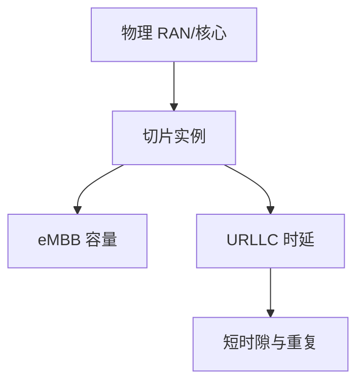

# 5G 切片与 URLLC

切片把同一物理 RAN/核心切成隔离的逻辑网络；URLLC 用短时隙与高可靠编码换毫秒级空口，牺牲频谱效率。

<footer>—— 据 3GPP TS 23.501 切片；TS 22.261 与 38 系列 URLLC 相关条款整理</footer>

[上一课](/cs/cellular-ran-core) 给出 RAN 与核心。eMBB 大带宽与工厂控制不能共用同一张「尽力而为」承载。缺口是**切片**与 **URLLC**：NSI 隔离资源；URLLC 要 $10^{-5}$ 量级空口可靠与毫秒延迟。本课不把卫星轨道写完。

## 问题

DiffServ 后课给 IP  hop 着色；切片更强：独立的控制面与用户面实例、SLA、可能独立的 UPF。URLLC：迷你时隙、免授权上行、重复传输，工作点远离香农极限换延迟——与 Wi‑Fi OFDMA 调度同类但有牌照与更硬的时间槽。不是 PFC：空口不能「暂停邻站一整口」来保证工厂周期。

不要把切片写成 VLAN：隔离在核心与 RAN 资源上，不止 802.1Q 标签。

eMBB / URLLC / mMTC 是 5G 三类场景。实现参差，本课钉合同：隔离与时延可靠指标，不点名某运营商套餐。

### 切片强于 DSCP

隔离的是实例与资源，不只 hop 着色。URLLC 用效率换尾延迟，工作点远离容量极限。实验室演示不等于全国 SLA。

## 方法

画：物理网 → 切片实例 → 不同 SLA。URLLC 路径：短 TTI → 编码重复 → 核心低时延转发。对照以太网 PFC：一跳反压 vs 端到端时延预算。

方法止于选定对象与对照；机制才说它如何嵌入已有分层与主干课。

## 机制

容量 $C$ 被切片划分：给 URLLC 的资源不能同时给 eMBB 满载。这是显式资源预留，与互联网核心的统计复用对照。移动性仍走核心锚，切片要跟着会话走。主干端到端：再可靠的空口也不替代应用校验。

与 Wi‑Fi 6 调度：都是时频资源分配；5G 有许可频谱与更硬的同步。

## 边界

本课不引入网络开放 API 的全部 NEF。卫星与高延迟链路是下一课。后课默认：切片 = 隔离逻辑网；URLLC = 用效率换尾延迟。

实验室演示不等于全国覆盖的 URLLC SLA。

上一课留下的缺口在本课收口；「5G 切片与 URLLC」进入后课词汇表后只引用。文献用来钉对象与边界，不把本课写成该主题的独立综述。下一课[卫星与高延迟链路](/cs/satellite-latency)。

## 小结

- 切片隔离 SLA，强于单跳 DSCP。
- URLLC 短时隙、重复、远离容量极限。
- 资源预留与互联网统计复用对照。
- 后课只引用本课钉死的对象，不从该领域总问题重开。
- 出处：3GPP TS 23.501、22.261。
