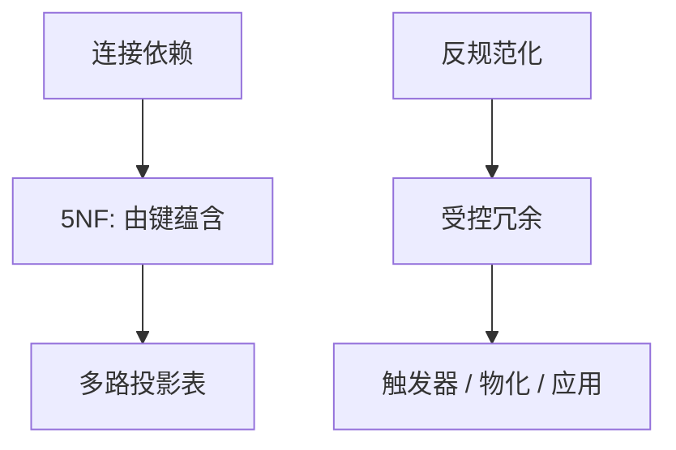

# 5NF 与反规范化

5NF 要求凡是无损的 n 路投影分解，其连接依赖都由候选键蕴含。反规范化则故意留下冗余，用完整性预算换少连接。

<footer>—— 据 Fagin, Normal Forms and Relational Database Operators, SIGMOD 1979；Date；Ramakrishnan and Gehrke</footer>

[上一课](/cs/mvd-4nf)沿独立多值拆表。本课不重定义 MVD。缺口有两向：更细的连接依赖（JD）与 5NF；以及工程上反向走的反规范化。依赖理论单元在此封口，优化器单元从 Selinger 再开。

## 问题

有的关系 4NF 已过，仍存在：它等于三个投影的连接，但任两路连接都不够——必须三路才无损。这是连接依赖 $* (X,Y,Z)$。5NF（投影-连接范式，PJ/NF）：每个 JD 都被候选键所蕴含（分解平凡）。实践中真正常见的是供应商–零件–项目一类约束，比 4NF 稀。

反规范化：故意保留违反 3NF/BCNF 的列（如订单行上重复顾客名），减少查询连接。缺口是把这写成**显式合同**：哪条 FD 不再由模式保证，改由应用、触发器或物化维护。不是「为了性能可以随便宽表」。

Fagin 1979。Date 强调 5NF 与「只按键连接」的直觉。物化视图是受控反规范化：有定义查询，维护规则可分析。宽表缓存若无定义，只是副本漂移。

## 方法

5NF 设计：若业务约束确实是三路可拼且两路不可，则拆成三张「键对」表。否则不要为理论而拆。反规范化：量连接代价与更新异常频率；冗余列随源列更新必须同步——触发器课的过程或后课物化刷新。

从 5NF 表再连回宽结果，是查询或视图，不是把基表重新加宽。OLAP 星型模式后课会系统性地反规范化维表；本课只给原则。

## 机制

无损分解的终点：5NF 说「没有额外的无损切法」。再拆只会增加连接、不消除由 JD 造成的异常。反规范化增加更新异常风险，换的是读路径上的连接与随机 I/O——代价模型在优化器单元量化，本课只定性。

与 ORM：宽对象常诱使反规范化；阻抗课已警告导航不是计划。冗余字段会让 N+1 看起来「少连表」，更新却更脆。

## 边界

本课不把 DKNF 等更强范式写入必做。也不开始 Selinger 搜索。域-键范式点名存在：约束若都能收成域与键，则理论漂亮，现实 CHECK 与触发器仍在。

后课默认：模式先按 3NF/BCNF/需要时 4NF 设计；5NF 仅当真正有多路 JD；冗余必须有维护者。优化器单元第一课：给定模式，如何搜连接顺序。

依赖理论补的是主干范式课的推导与 4NF/5NF；不是重开关系模型第一课。

## 小结

- 5NF 处理非平凡连接依赖，比 4NF 更稀。
- 反规范化是显式冗余加维护，不是忘了分解。
- 下一单元 Selinger 动态规划：在合法计划空间里搜代价。
- 出处：Fagin 1979；Date；Ramakrishnan and Gehrke。
