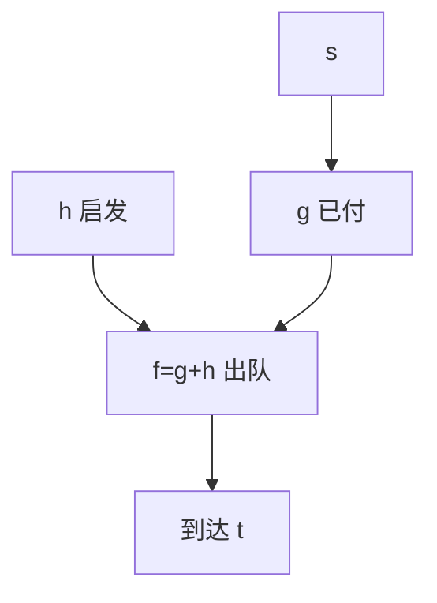

# A* 与启发式搜索

$f(n)=g(n)+h(n)$：已付代价加到达目标的估计；一致启发下 A* 展开的结点不超过任何同等启发的最优搜索。

<footer>—— 据 Hart, Nilsson and Raphael, A Formal Basis for the Heuristic Determination of Minimum Cost Paths, 1968；Dijkstra 1959 对照整理</footer>

上一课[图同构直觉](/cs/graph-isomorphism)收束连通与匹配单元。主干[Dijkstra](/cs/dijkstra)是 $h=0$ 的最短路。本课缺口是**启发式** $h$：低估到 $t$ 的距离时，优先队列按 $g+h$ 取出仍正确。不重证非负权取出即钉死的那套，只把它改成带势的比较。后课双向与 ALT 把 $h$ 造得更狠。

## 问题

状态图（网格、配置）上单源到 $t$。$g(n)$ 为从 $s$ 到 $n$ 的已知代价。$h(n)$ 估计 $n$ 到 $t$。可采纳（admissible）：$h(n)\le\delta(n,t)$。一致（consistent）：$h(u)\le w(u,v)+h(v)$。一致 $\Rightarrow$ 可采纳；此时 A* 与带势 Dijkstra 相同：$\hat w(u,v)=w(u,v)+h(v)-h(u)\ge 0$，按 $g+h$ 取出即钉死。

缺口是 $h$，不是新的堆。$h=0$ 即 Dijkstra。过高估计可能丢最优，变成贪心最佳优先搜索。

### 启发来自松弛问题

网格用曼哈顿；图上用欧氏（若边权 $\ge$ 直线）。可采纳常来自删除约束后的真距离。不要把机器学习的启发式当本课正确性条件——除非仍可采纳。

Hart–Nilsson–Raphael 1968。Pearl 的启发式搜索书是后续。一致启发下不会 decrease-key 到已钉死结点（与 Dijkstra 同）。后课 ALT 用路标算 $h$。

## 方法

优先队列键 $f=g+h$。取出 $u$，若 $u=t$ 停（一致时）。松弛邻接，更新 $g$ 与父指针。启发式预计算或闭式。

不一致但可采纳时需允许重开结点，最坏仍可能指数展开，本课默认一致。

## 机制

势函数把原权变成非负，Dijkstra 正确性平移。展开结点集：任何 $f(n)\lt \delta(s,t)$ 的 $n$ 都必须展开，故 $h$ 越大（仍可采纳）剪掉越多。与 DFS/BFS：无权且 $h=0$ 不是 A* 的主场景；网格上 A* 典型。

不要在负权图上直接 A*：先 Bellman–Ford 或禁负。

## 边界

本课不写 IDA*、不写 SMA*。不把博弈树的 $\alpha\beta$ 当同一算法。后课默认：一致 $h$ 下 A* 最优；实现是带势 Dijkstra。下一课双向搜索与 ALT 路标。

## 小结

- 可采纳 $h$ 保证最优；一致则取出即钉死。
- $h=0$ 退回 Dijkstra；过大 $h$ 丢最优。
- 启发来自松弛真距离。
- 出处：Hart, Nilsson and Raphael, 1968。
