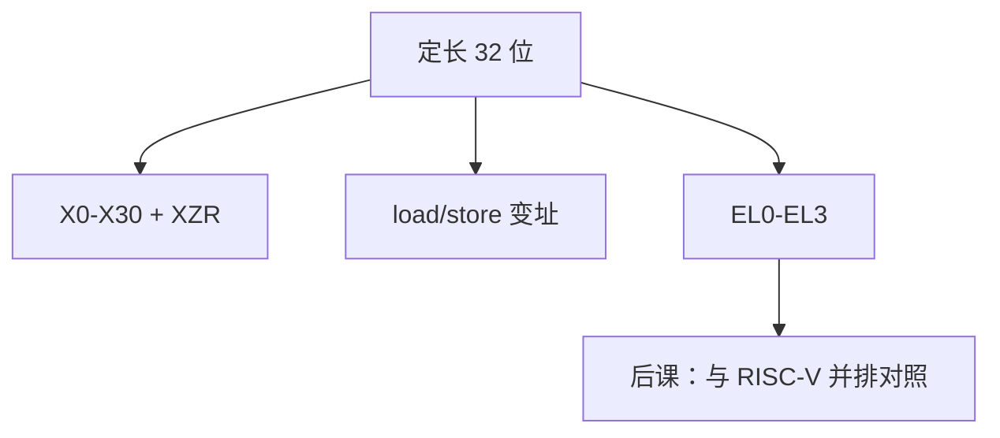

# ARM AArch64

  
A64 定长 32 位，31 个通用寄存器加零寄存器，load/store，条件码与可选的条件执行残留在比较与分支上，而不是 x86 那种变长外壳。

  <footer>—— 据 ARM Architecture Reference Manual for A-profile；Hennessy and Patterson, CA:AQA 整理</footer>

[上一课](/cs/x86-microcode-decode)展示了 CISC 前端税。缺口是另一条工业主线 **AArch64**：定长、宽寄存器堆，作为后课与 RISC-V 对比的一端。不把 ARMv7 Thumb 变长当本课主体。

## 问题

A64：4 字节对齐指令，`Xn`/`Wn`，`XZR`/`WZR` 读零写丢弃（类似 `x0`）。寻址：基址+偏移、预/后变址、PC 相对。条件码 NZCV 在 `PSTATE`，分支可条件。缺口不是 μop ROM，而是这套**程序员模型**：异常级 EL0–EL3、SPSR、VBAR，对照 RISC-V 的特权与 `mtvec`。

NEON/SVE 是 SIMD/向量，后课再接。本课钉整数与系统寄存器骨架。

### AArch64 不是「安卓专用 ISA」

它是 A-profile 64 位架构，服务器与桌面同样存在。把 ARM 当成手机品牌或 GPU，对照课会失去指令级内容。微结构（乱序宽度）与 ISA 分开，和 x86 一样。

ARM ARM 是规范。CA:AQA 用 ARM 作 RISC 例。PCS（Procedure Call Standard）是 ABI，最后一课边界再收。本课不背全部系统寄存器名。

## 方法

取指对齐 4 字节，译码组合字段（比 x86 短）。`ldr`/`str` 可带扩展/移位的索引。立即数逻辑编码是特殊位模式，不是任意 32 位——编译器选 `mov` 序列。原子：`ldxr`/`stxr` 在后课 LR/SC。

复位：实现定义入口，固件（TF-A）类似 UEFI 角色。GIC 对照 APIC。

## 机制

下一课明确 ARM vs RISC-V：特权、压缩、向量哲学、生态。本课只让 A64 成为可引用的 ISA，而不是「另一种 x86」。条件码相对 RISC-V 的显式比较分支是差异点，谓词课再扩。

## 边界

本课不写 M-profile 微控制器，不把 TrustZone 世界切换写成完整安全课。不列每家微结构的流水线。

后课默认：AArch64 是定长 RISC 式 load/store ISA，带 NZCV 与异常级。

## 小结

- A64：32 位定长、31 GPR、load/store。
- 异常级与系统寄存器构成特权。
- 前端税低于 x86 变长。
- 出处：ARM ARM A-profile；Hennessy and Patterson, CA:AQA。
