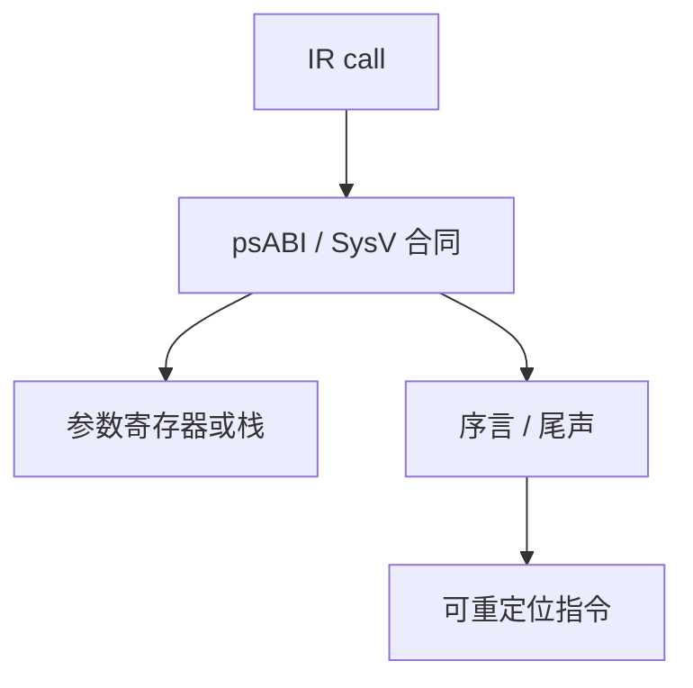

# ABI 与代码生成

应用程序二进制接口规定寄存器谁保存、参数怎么传、栈帧怎么长；代码生成必须按同一份文档发指令，函数才能跨编译单元互调。

<footer>—— 据 System V Application Binary Interface, AMD64 Architecture Processor Supplement；RISC-V ELF psABI 整理</footer>

上一课[窥孔与窥视窗](/cs/peephole)清理了函数体内的短序列。[调用约定与栈](/cs/peephole)在组成课已讲帧与返回地址；[RISC-V 整数指令](/cs/riscv-int-isa)已给出 `jal`/`jalr` 与整数寄存器名。本课不重画五级流水线。缺口是：把那些硬件事实**写成跨编译器的合同**——哪几个是参数寄存器、哪几个 callee-save、栈对齐、谁清参数区——并在序言/尾声里真正发射。

## 问题

着色已选物理寄存器，但「`x10` 是第一个整数参数」不是 ISA 强制，是 ABI。两个目标文件若一个把返回值放 `x10`、一个去栈上找，链接起来仍崩。缺口是代码生成器遵守一份 ABI 文本：System V AMD64 或 RISC-V psABI，而不是发明第四种约定。

序言：保存返回地址与 callee-save、调整 `sp`、对齐。尾声：恢复、返回。可变参数、结构体返回按文档走间接。本课不重讲异常入口。

### ABI 不是 ISA 子集

ISA 说指令编码；ABI 说软件约定。无 ABI 的「合法机器码」仍无法与 libc 互调。组成课的调用约定课给了栈直觉；本课把寄存器号与对齐钉到可汇编。

System V AMD64 ABI 与 RISC-V ELF psABI 是平台文档。本课引用它们的规则层级，不抄整张寄存器表。

## 方法

按目标选 ABI。参数：前几个进规定寄存器，其余入栈。生成 call：把实参挪到合同位置，`jal`/`call`。被调者按合同保存。栈槽给溢出与局部，对齐 16 字节等条款写进帧布局。

窥孔不得破坏合同处的 `sp` 与保存集。

## 机制

同一 ISA、不同 OS 可以不同 ABI（Windows x64 对 System V）。交叉编译必须选对三元组。叶子函数可简化序言，仍须对齐与红区规则（若文档有红区）。本课点名，不把红区当所有目标的默认。

与特权级、系统调用号：那是另一份 ABI（syscall ABI），后课操作系统再接；本课是用户态函数调用。

## 边界

本课不解析 ELF 重定位项、不加载共享库。不实现完整 libc 启动（`_start`、`argc`）。后课默认：每个函数的入口出口遵守目标 ABI。链接把符号引用变成地址。

## 小结

- 代码生成按 ABI 放参数、保存寄存器、对齐栈。
- 先修：调用约定课 + RISC-V 整数 ISA；合同文本是 SysV/psABI。
- ISA 合法不等于能与其他目标文件互调。
- 出处：System V AMD64 ABI；RISC-V ELF psABI；Aho et al., 龙书第 7–8 章。
