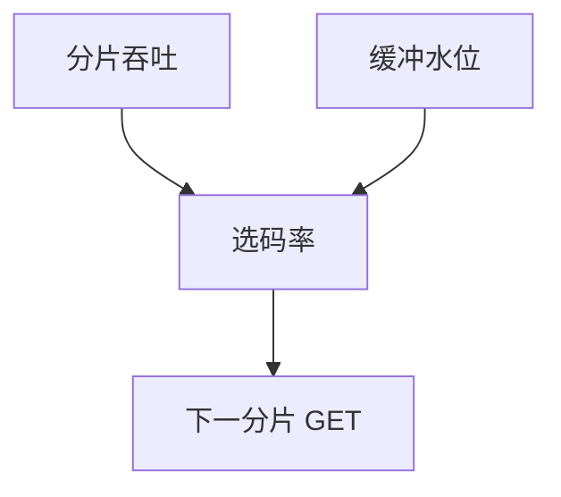

# ABR 自适应码率

播放器根据吞吐估计与缓冲水位在阶梯码率间切换，逼近瞬时可用带宽，避免卡顿或无谓的 4K。

<footer>—— 据 Huang et al. 缓冲基 ABR；DASH/HLS 实践；Kurose 多媒体节整理</footer>

[DASH/HLS](/cs/dash-hls) 提供阶梯。[速率自适应](/cs/mimo-rate-adaptation) 在 Wi‑Fi PHY。[上一课](/cs/dash-hls) 留下选哪一档。缺口是 **ABR 控制**：吞吐估计、缓冲、振荡。本课不把 CDN 层次写完。

## 问题

可用带宽随 Wi‑Fi、蜂窝、同屋流变化。固定高码率则再缓冲；固定低则浪费 $C$。ABR：测最近分片吞吐，看缓冲秒数，选下一表示。过敏则码率振荡（视觉差），过钝则卡。与 TCP CC 叠：ABR 在应用，CUBIC 在运输，双环。BBR 下估计更稳或仍抖，取决于实现。

不要把 ABR 写成 5G 切片保证。

缓冲基（BBA）等算法。本课不点名商业播放器。

### 应用层跟踪可用带宽

与 TCP/BBR 双环，要滤波防振荡。令牌桶边缘限速会表现为「网慢」。清单缺中间档则跳变。

## 方法

对照：基于吞吐 / 基于缓冲 / 混合。画：下片 → 估 BW → 选档。与令牌桶：边缘限速会让 ABR 降档，表现为「网很慢」。

方法止于选定对象与对照；机制才说它如何嵌入已有分层与主干课。

## 机制

CDN 不同 POP 吞吐不同，切换 POP 像路径变。ECN 膨胀影响估计。QUIC 迁移换路要重新估计。无线 TCP 误码让吞吐锯齿，ABR 应滤波。与 WFQ：隔离后估计更干净。

安全：恶意慢片可诱骗降档，点名。

## 边界

本课不引入强化学习 ABR 的全部。CDN 缓存层次与失效是下一课。后课默认：ABR 是应用层对可用带宽的阶梯跟踪。

清单若缺中间档，控制再好也跳变。

上一课留下的缺口在本课收口；「ABR 自适应码率」进入后课词汇表后只引用。文献用来钉对象与边界，不把本课写成该主题的独立综述。下一课[CDN 缓存层次与失效](/cs/cdn-cache-hierarchy)。

## 小结

- 吞吐与缓冲驱动选档。
- 与 TCP/BBR 形成双环，要滤波。
- 目标是卡顿与质量折中，不是峰值码率。
- 后课只引用本课钉死的对象，不从该领域总问题重开。
- 出处：ABR 文献；DASH/HLS 实践。
