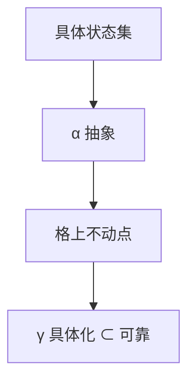

# 抽象解释

在抽象域上模拟程序：具体状态集被 Galois 连接压成格上的元素。不动点给出不变量，服务于类型之外的静态分析。

<footer>—— 据 Cousot and Cousot, Abstract Interpretation, 1977；龙书数据流章对照；[Knaster–Tarski](/cs/knaster-tarski-fixpoint) 整理</footer>

上一课[指称](/cs/denotational-semantics)给出理想含义，太大算不了。缺口是**可靠近似**：区间、符号、符号执行的亲戚——抽象解释。主干[数据流](/cs/dataflow-liveness)是同一家族的方程；本课钉 Galois 连接与加宽，不把所有抽象域列成百科。类型系统是一种抽象（类型是抽象值），但本课面向分析器。

## 问题

具体收集语义：每个程序点的可达状态集。无限。抽象：区间 $[L,H]$、符号、八边形。Galois：$(\alpha,\gamma)$ 保证抽象转移 $\nabla$ 可靠（不漏具体行为）。缺口是**可靠与精度的权衡**，不是 SOS 的一步规则。

加宽（widening）强迫升链收敛，可能损失精度；变窄再收回一点。循环必须处理——后课自然循环识别与此衔接。

### 可靠不是完备

分析可说「可能别名」而其实没有——假阳性。完备相对选定抽象域：域表达不了的性质永远未知。不要把「未报错」当程序无错（若目标是找 bug，漏报更危险，方向会调）。

Cousot–Cousot 1977（POPL）。龙书把到达定值、可用表达式写成数据流，是有限高度格上的抽象解释特例。本课不写 Astrée 的全部域。

## 方法

选抽象域与转移。解 $X=F(X)$ 用迭代+加宽。用于：值范围、空指针、常量（后课常量传播是平坦域）。类型推导也可看成抽象：合一是精确的，子类型是近似方向。

与效应、区域：可当抽象域的分量。与 SMT：抽象解释给不变量，SMT 可在路径上精化，[SMT](/cs/smt-solver) 已见。

## 机制

Galois 连接保证可靠；若不要求连接，至少要 sound transformer（over-approx）。并行与弱内存使具体语义本身难写，分析更保守。

不要用抽象解释替代线性/借用：后者是语言纪律，前者是对已写程序的近似。

## 边界

本课不实现完整区间分析器。后课默认：数据流优化是有限格上的 AI。下一课空与 Option：把「可能空」从分析变成类型。

也不把机器学习当抽象域。

## 小结

- 抽象解释：Galois + 格不动点，可靠近似收集语义。
- 数据流是特例；加宽服务循环。
- 可靠≠完备；假阳性与漏报取决于问题方向。
- 出处：Cousot and Cousot, 1977；对照龙书数据流；Knaster–Tarski。
