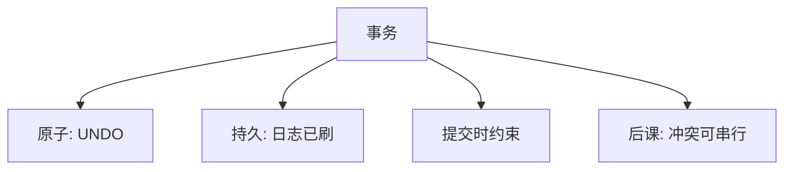

# 事务 ACID

原子、一致、隔离、持久把「一次业务步骤」收成失败可撤、成功则永在的单位。

<footer>—— 据 Haerder and Reuter, Principles of Transaction-Oriented Database Recovery, CSUR 1983；Gray and Reuter</footer>

[上一课](/cs/checkpoint)保证崩溃后日志能把页拉回一致的物理状态。本课不重做 CLR。缺口是：用户看到的不是页，而是**事务**——一组读写要么都发生，要么都不发生。ACID 四字把恢复、完整性、并发与持久绑在同一个接口上；每一字的机制已经或即将由邻课承担，本课负责命名与分工。

## 问题

一次转账是两次更新。进程可以在中间被杀，并发可以交错，约束可以暂时假。缺口不是再讲 WAL，而是把工作单位说清：**A** 原子：没有「只扣了一边」；**C** 一致：提交后满足声明的完整性；**I** 隔离：并发看起来像某种串行；**D** 持久：提交后崩溃仍在。没有这个单位，应用只能自己在套接字与文件上拼补偿。

Haerder and Reuter 1983 把 recovery 与 ACID 放在同一篇文章里讲。C 在他们那里偏完整性约束；隔离的精确数学是后课冲突可串行。

## 方法

事务：begin 到 commit/abort。原子与持久靠 WAL + ARIES：commit 记录刷盘则 D 成立，abort 或崩溃走 UNDO 得 A。一致靠[键与完整性](/cs/keys-integrity)在事务边界检查——可以允许事务内部暂时违例，提交时必须真。隔离下一课才用冲突图；本课只声明需要一个并发正确性标准。

## 机制

ACID 是规格，不是一种算法。实现可以锁、可以多版本、可以单线程串行。D 不要求数据页已刷，只要求日志已刷——[WAL](/cs/wal)已说。A 不要求执行时没有脏页，只要求对外从不展示半成品提交。C 不能单靠恢复：恢复只回到「约束曾被承诺的状态」，若应用逻辑本身写错，C 仍假。

本课不把「BASE」「最终一致」写成 ACID 的对立宗教；那些是后课隔离级别与分布式下的显式放松。

## 边界

不要把 ACID 当成「数据库很慢的原因」。每一字都可以用不同强度实现。也不要在本课展开脏读、幻读——那是隔离级别课用异常命名的缺口。分布式下 D 与 A 还要跨节点，入口在两阶段提交。

单语句自动提交也是事务，只是边界与语句重合；没有 begin 不等于没有 A/D。后课默认：谈到事务，四字已分工；并发正确性从冲突可串行讲起，而不是从「锁住一切」讲起。

四字拆开之后，实现可以换：A/D 用日志，I 用锁或版本，C 用约束。用户接口仍是 begin/commit/abort。

## 小结
- 没有隔离标准之前，「并发正确」没有对象；下一课用冲突图给尺子。
- 约束可以推迟到提交时检查，那是 C 与 I 的交界，不是 WAL 的事。

- 恢复已能 REDO/UNDO；本课把用户单位命名为事务并拆开 ACID。
- A/D 靠日志；C 靠约束；I 尚未给出调度标准。
- 冲突可串行是隔离的第一根尺子。
- 出处：Haerder and Reuter, 1983；Gray and Reuter, *Transaction Processing*。
