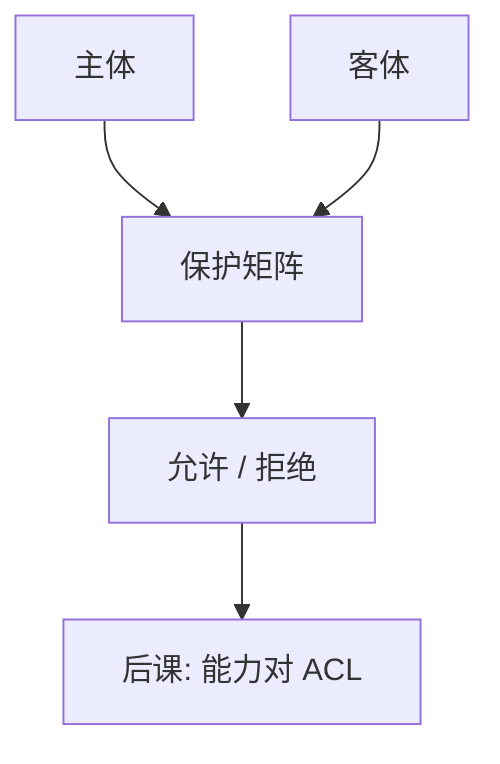

# 访问控制与最小特权

认证回答是谁；授权回答可以碰什么。最小特权要求主体只拿到完成该任务所需的那一小撮权限。

<footer>—— 据 Lampson, Protection, 1971/1974；Saltzer and Schroeder, The Protection of Information in Computer Systems, 1975</footer>

[上一课](/cs/oauth-oidc)建立了「这次是谁」。本课不重做挑战–响应。缺口是：同一身份对不同对象应有不同权限。操作系统已有[特权级](/cs/privilege-rings)；这里把 Lampson 的保护矩阵收成：主体、客体、操作，以及最小特权作为设计规则，而不是「登录成功即管理员」。

## 问题

认证通过之后若默认全开，CIA 的 C 与 I 立刻失败。缺口不是再讲内核用户态，而是访问控制：矩阵 $M[\mathit{subject},\mathit{object}]$ 列出允许的操作。ACL 按客体存「谁可以怎样」；下一课对照能力。最小特权：每次授予取任务所需最小集，过期收回——与数据库角色、文件系统 mode 是同一矩阵的不同投影。

Saltzer–Schroeder 把最小特权、完全中介、失败安全默认列为原则。完全中介：每次访问都查，而不是登录时查一次以后放行。

## 方法

引用监视器：所有访问经过同一检查点。策略：自主（DAC，属主可转授）、强制（MAC，标签主导）、基于角色（RBAC）。本课不把 SELinux 类别写完，只锁定：策略与认证分离，检查发生在每次敏感操作。数据库 GRANT 与 OS 权限是同一思想在不同客体上。

## 机制

最小特权缩小泄露半径：证书私钥进程不应同时持有全库 DROP。完全中介与[系统调用路径](/cs/syscall-path)对齐：内核是监视器的一种实现。失败安全：查不着策略则拒绝，而不是放行。日志（审计）服务完整与事后可用，不是授权本身。

转授必须可收回。收不回的授权会随时间变成最大特权。

## 边界

不要把防火墙规则当成唯一的访问控制。也不要把「最小特权」写成「用户很难过」：任务变了要能提权（受控、短暂）。混淆代理人（confused deputy）是 ACL 的经典失败，下一课用能力对照。

角色爆炸与过宽角色是 RBAC 的实践边界：最小特权被「方便」吞掉。后课默认：已认证主体每次访问都经策略；实现可以是 ACL 表，也可以是不可伪造的能力票。

审计日志记录谁碰了什么，服务事后完整，不替代当时的拒绝。监视器失效时，日志也不可信，TCB 要把两者一起算进去。

## 小结
- 完全中介要求每次访问都查，登录时发一张终身通行证违反原则。
- 后课能力用票表示同一矩阵的行。

- 认证之后必须有矩阵式授权；最小特权限制授予集。
- 完全中介：每次访问都查。
- ACL 与能力是两种表示，对照在下一课。
- 出处：Lampson, 1971；Saltzer and Schroeder, 1975。
