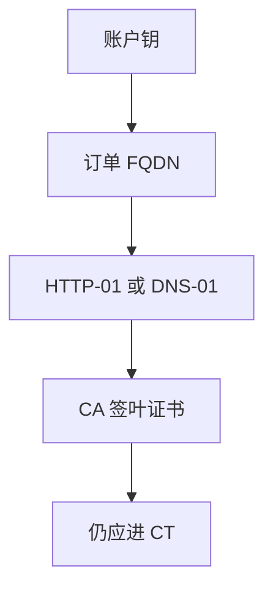

# ACME

Let’s Encrypt 把「证明你控制该域名」收成 HTTP-01 / DNS-01 挑战，证书申请从工单变成协议。自动化降低过期，也把挑战实现错误变成新的攻击面。

<footer>—— RFC 8555；Barnes et al., Automatic Certificate Management Environment</footer>

## 定位

上一课[CT](/cs/certificate-transparency)要求证书可被看见。缺口是**谁有资格让 CA 签这张叶**：ACME 用挑战证明控制权，替换人工邮件确认。不重写链验证。

后课默认已经读完本课钉下的合同，只补差，不从该领域第一性原理重开。

## 问题

手工签发导致过期与弱私钥。ACME：账户密钥、订单、挑战、下载。HTTP-01 在约定路径放令牌；DNS-01 放 TXT。缺口是挑战的绑定：若攻击者能写你的 `.well-known` 或改你的 DNS，就能申请到证——这是控制面安全，不是 AES 的锅。

### 通配与多名字

一张证多个 SAN 要每个都过挑战。通配通常强制 DNS-01。

RFC 8555。Let’s Encrypt 是部署实例，协议不绑一家 CA。本课不提供抢注或劫持挑战的步骤。

## 方法

按账户→订单→挑战→签发走状态机。强调私钥在申请人主机生成，CA 只签公钥。续期同样要过挑战。对照：企业私有 CA 可用同一思想走内部 ACME。

图中节点是本课的机制骨架；课程不把图展开成可运行的攻击步骤。

## 机制

身份证明从「组织开信」改成「当时能写该名下的资源」。TLS 的保密不自动保护挑战路径：HTTP-01 常先走 80 端口。CAA 记录限制哪些 CA 可签，是另一层政策。

前提写进合同之后，游戏外的误用只当失败模式点名，不在本课写成操作程序。

## 边界

本课不写全部挑战类型的边界案例。下一课 TLS 攻击史：套件与实现的历史失败，默认假设证书验证与 ACME 已在。

## 小结

- CT 看见证书；ACME 证明当时控制该名。
- 挑战实现错误等于把签发权交给能写 Web/DNS 的人。
- 私钥本地生成；续期仍要挑战。
- 下一课：TLS 攻击史当合同对照。
- 出处：RFC 8555；Let’s Encrypt 设计叙述；对照 RFC 5280。
