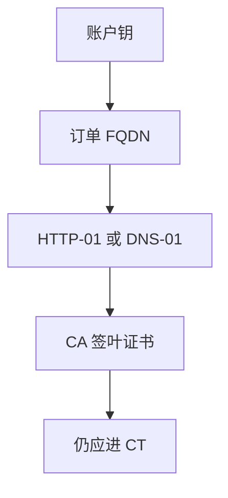
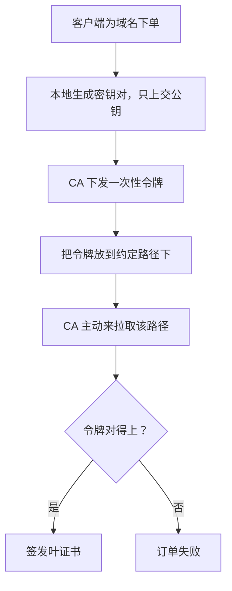

# ACME

Let’s Encrypt 把「证明你控制该域名」收成 HTTP-01 / DNS-01 挑战，证书申请从工单变成协议。自动化降低过期，也把挑战实现错误变成新的攻击面。

<footer>—— RFC 8555；Barnes et al., Automatic Certificate Management Environment</footer>

上一课[CT](/cs/certificate-transparency)要求证书可被看见。缺口是**谁有资格让 CA 签这张叶**：ACME 用挑战证明控制权，替换人工邮件确认。不重写链验证。

后课默认已经读完本课钉下的合同，只补差，不从该领域第一性原理重开。

## 问题

手工签发导致过期与弱私钥。ACME：账户密钥、订单、挑战、下载。HTTP-01 在约定路径放令牌；DNS-01 放 TXT。缺口是挑战的绑定：若攻击者能写你的 `.well-known` 或改你的 DNS，就能申请到证——这是控制面安全，不是 AES 的锅。

### 通配与多名字

一张证多个 SAN 要每个都过挑战。通配通常强制 DNS-01。

RFC 8555。Let’s Encrypt 是部署实例，协议不绑一家 CA。本课不提供抢注或劫持挑战的步骤。

术语翻译：DNS-01 挑战就是「CA 让你在该域名的 DNS 里放一条指定内容的 TXT 记录，它再去查询核对」。能改一个域名的 DNS，通常就意味着真的控制它——所以泛域名证书（形如星号点 example.com）一般强制走 DNS-01。

数字实例：Let's Encrypt 签发的证书有效期是 90 天。看似很短，但 ACME 把续期做成了全自动（定时任务跑一遍挑战即可），短有效期才可行——私钥泄露后的可用窗口也按同样比例缩短。

## 方法

按账户→订单→挑战→签发走状态机。强调私钥在申请人主机生成，CA 只签公钥。续期同样要过挑战。对照：企业私有 CA 可用同一思想走内部 ACME。

```mermaid
flowchart TD
  ACC["账户钥"] --> ORD["订单 FQDN"]
  ORD --> CH["HTTP-01 或 DNS-01"]
  CH --> CRT["CA 签叶证书"]
  CRT --> CT2["仍应进 CT"]
```

## 机制

身份证明从「组织开信」改成「当时能写该名下的资源」。TLS 的保密不自动保护挑战路径：HTTP-01 常先走 80 端口。CAA 记录限制哪些 CA 可签，是另一层政策。

第一张图画的是 ACME 的四个环节怎么连；这张图回答第二个问题：一次 HTTP-01 挑战里双方各做什么、CA 到底验证的是什么绑定。

```mermaid
flowchart TD
  REQ["客户端为域名下单"] --> GEN["本地生成密钥对，只上交公钥"]
  GEN --> TOK["CA 下发一次性令牌"]
  TOK --> PLACE["把令牌放到约定路径下"]
  PLACE --> FETCH["CA 主动来拉取该路径"]
  FETCH --> MATCH{"令牌对得上？"}
  MATCH -->|"是"| SIGN["签发叶证书"]
  MATCH -->|"否"| FAIL["订单失败"]
```

常见误区：初学者容易以为「能上 HTTPS 了，网站就安全了」。ACME 只证明「申请那一刻有人控制该域名」：若攻击者能写你的点 well-known 目录或改你的 DNS 记录，它同样能通过挑战、以你的名义拿到正规证书。这是控制面的洞，与 TLS 加密强度无关。

## 边界

本课不写全部挑战类型的边界案例。下一课 TLS 攻击史：套件与实现的历史失败，默认假设证书验证与 ACME 已在。

## 小结

- CT 看见证书；ACME 证明当时控制该名。
- 挑战实现错误等于把签发权交给能写 Web/DNS 的人。
- 私钥本地生成；续期仍要挑战。
- 下一课：TLS 攻击史当合同对照。
- 出处：RFC 8555；Let’s Encrypt 设计叙述；对照 RFC 5280。
