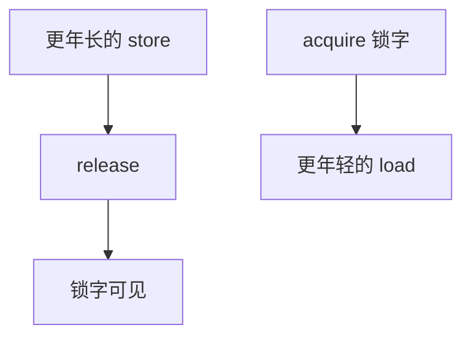

# acquire / release

释放之前的写必须在锁释放这一刀之前对全局可见；获取之后的读必须在锁获取这一刀之后才开始。不必对全世界做全序栅栏。

<footer>—— 据 Boehm and Adve, Foundations of the C++ Concurrency Memory Model, PLDI 2008；SPARC RMO 整理</footer>

[上一课](/cs/atomic-cache-impl) 保证单个地址的 RMW 不被切开。程序员写互斥时还需要：**解锁之前对共享数据的 store，要被下一位加锁成功的人的 load 看见。** [MESI](/cs/mesi-protocol) 不管两个地址之间的顺序。本课不重做 cache lock。缺口是**acquire/release：比 seq-cst 全栅栏弱、比 relaxed 强的单向屏障。**

## 问题

核 A：`data=1; unlock`。核 B：`lock; x=data`。若 `unlock` 的 store 与 `data` 的 store 在写缓冲里重排，B 可能看到锁已开、`data` 仍是 0。seq-cst fence 能修，但把无关的访存也挡住，[MLP](/cs/mlp-memory-parallelism) 与 store 缓冲收益尽失。缺口不是更重的原子，而是**释放：此前写不能越过释放；获取：此后读不能越过获取。**

C++11 / RISC-V 的 `release`/`acquire`、ARM 的 `dmb ishld` 一类，都是这个单向约束。x86 TSO 对 store 已经很强，许多释放几乎免费，获取仍要限制 store 前的 load 重排——实现上常已满足。

## 方法

微结构：release store 在 SQ 里等到更年长的 store 都变成一致性可见（drain 到某一点）再发出；acquire load 之后的访存等该 load 完成（至少数据返回且获得足够权限）。不必等全世界的无关行。与 [写合并](/cs/write-combining)：WC 区域的 drain 规则更严，release 往往强制冲刷 WCB。

## 机制

这是内存模型与 cache 协议的接口：协议提供单行上的「可见」，模型把多行用 acquire/release 串起来。乱序核的 [LSQ](/cs/lsq-disambiguation) 必须禁止跨越这些点的投机重排，或在发现违规时 replay。比下一课事务内存弱：这里没有多行原子提交，只有顺序约束。

relaxed 原子只保证该地址 RMW 的原子性，不提供这把「刀」。seq-cst 在所有核上插一把全序，实现上接近更重的 fence。锁的正确写法是 release 解锁、acquire 加锁，数据本身用普通访存即可——数据竞争自由程序的编译器契约。

## 边界

本课不把 C++ 的 memory_order 矩阵整页抄来。也不把 Linux `smp_mb` 的各种变体列全。事务内存试图把临界区里的多行读写作一个原子块，失败则 abort，下一课。fence 指令的微结构代价再下一课单独记账。

后课默认：锁配对用 acquire/release 即可表达可见性，不必每条访存 seq-cst。把整个临界区包成硬件事务是另一条路。

## 小结

- acquire/release 是单向屏障，服务锁的可见性，弱于全序 fence。
- 实现上主要约束 SQ drain 与后续访存的发射。
- 多行投机原子块是下一课事务内存。
- 出处：Boehm and Adve, *PLDI*, 2008；SPARC RMO；Hennessy and Patterson, *CA:AQA*。
