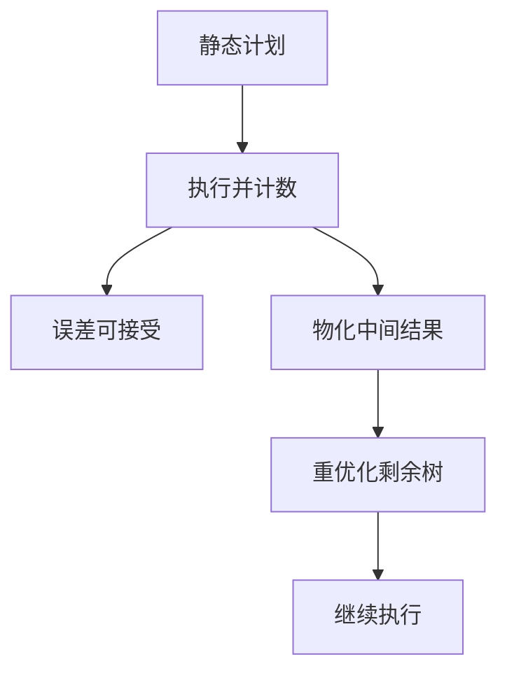

# 自适应查询处理

计划在优化时冻结；数据在执行时揭晓。自适应处理在管道中观察基数与延迟，切换算子或重优化剩余树。

<footer>—— 据 Kabra and DeWitt；Avnur and Hellerstein, Eddies；Deshpande, Ives and Raman 综述</footer>

[上一课](/cs/cost-model-calibration)把尺子对准机器。本课不重拟合权重。缺口是运行时：即使基数与权重当时看起来对，参数、倾斜、相关仍可能让中间结果爆。自适应查询处理（AQP）在执行中收集反馈，改变剩余计划，而不是等语句结束才把实际行数写进日志。

## 问题

静态优化：一次 DP，整树固定。发现哈希表打满内存时已经晚了。策略包括：缓冲监测点，若实际行数与估计偏离超过阈值则**重优化**未执行子树；选择路由（eddy）把元组动态送给当时最合适的算子；切换连接算法（hybrid hash 的 infight 调整）。缺口是**正确性**：切换后指称仍是同一查询，隔离与谓词不能丢。

与计划缓存冲突：自适应改的是这一次执行，下次仍可能用坏的缓存计划——反馈应能更新统计或令牌化「这次参数要特殊计划」。

Kabra and DeWitt 的 mid-query reoptimization。Avnur and Hellerstein 的 Eddy（SIGMOD 2000）。综述见 IEEE TKDE 上 Deshpande, Ives, Raman。本课不把连续自适应当默认 OLTP 路径：短查询重优化成本可能高于执行。

## 方法

插入测量算子或在现有迭代器里计数。阈值：估计/实际比超限 → 停管道、把已有中间结果物化、对剩余 SQL（或逻辑树）再跑 DP。Eddies：元组带就绪标志，路由策略学习哪一谓词选择率高。本课以重优化为主，eddy 点名。

内存：自适应切到 Grace 分区哈希（后课执行引擎）是算子内自适应，不一定重跑整个优化器。

## 机制

事务：重优化发生在同一语句、同一快照；不能换成另一隔离语义。并行：exchange 已把数据切到线程，重优化要协调暂停。OLTP 短查询：自适应常关闭，只在 OLAP 长查询开。

反馈回路：把实际基数写回，供下一次优化或学习型优化器。本课只要求这一次执行能救，学习模型下一课。

## 边界

本课不把强化学习优化器当 AQP 的同义词。提示与冻结计划是反自适应：DBA 不要执行中途变。计划回归课会谈「自动换计划」的运维恐惧。

后课默认：长查询可以设监测点；短查询信静态计划加统计。学习型优化器把历史反馈变成下一次的搜索先验。

自适应补的是估计失败，不是执行引擎的向量化。

## 小结

- 监测实际基数，超阈则物化并重优化剩余树。
- 指称与快照必须不变；短查询往往不值得。
- 学习型优化器下一课：把多次反馈收成模型。
- 出处：Kabra and DeWitt；Avnur and Hellerstein；Deshpande, Ives and Raman。
