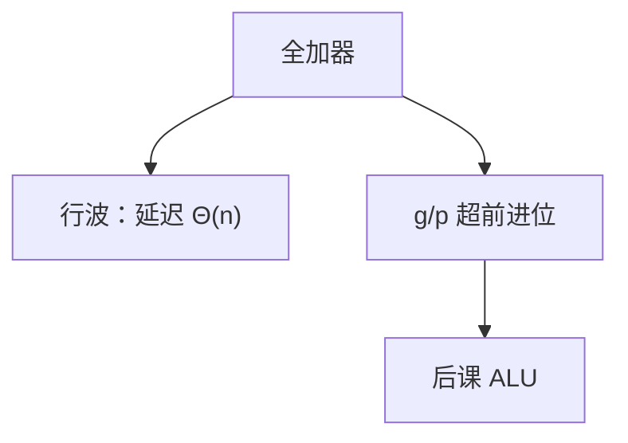

# 加法器与超前进位

一位全加器只看本位与进位入；若进位沿位片行波，延迟与位宽成正比，超前则用生成与传播一次算出各位进位。

<footer>—— 据 Harris and Harris, Digital Design and Computer Architecture；Patterson and Hennessy, Computer Organization and Design (RISC-V) 整理</footer>

上一课[译码器与编码器](/cs/decoder-encoder)钉死了编号与独热的组合块。[进制](/cs/decoder-encoder)已要求同权位相加。本课不重讲位权，也不从补码溢出判定再证一遍。缺口是：**加法电路**的结构与延迟——行波太慢，超前进位用生成/传播把进位变成两级组合。

## 问题

全加器：$(c_{i+1},s_i)=\mathrm{add}(a_i,b_i,c_i)$。串 $n$ 位，若 $c_{i+1}$ 等 $c_i$，则 $t_{pd}=\Theta(n)$。字长 32、64 时，这会卡住后课单周期周期。缺口因此不是新的数值定义，而是进位的布尔：生成 $g_i=a_i b_i$，传播 $p_i=a_i+b_i$（或 $a_i\oplus b_i$），则 $c_{i+1}=g_i+p_i c_i$，展开成只依赖 $a,b$ 与 $c_0$ 的与或，深度与 $n$ 的关系变成对数级（分组 CLA）或至少远小于 $n$。

溢出判定用最高位进位与次高位进位异或，[补码课](/cs/twos-complement)已给语义，本课只接线。

### 超前不是「异步提前算下一指令」

CLA 仍是同一组合块内部的捷径，没有时钟、没有指令。把 carry-lookahead 理解成流水线超前，名字会污染后课。行波加法器功能与 CLA 相同，只是 $t_{pd}$ 不同。

Harris 用 4 位 CLA 作积木再分层。Patterson/Hennessy 强调 ALU 的加是关键路径候选。本课不把超标量、先行指令执行扯进来。

## 方法

1 位全加器两级门。RCA：进位链。CLA：计算全体 $g,p$，再用组合网络出 $c_i$。分组：组生成 $G$、组传播 $P$，树形连接。减法：$\bar b$ 加 $c_0=1$，与补码取负一致。

## 机制

后课 ALU 把加减当成这一块，再 MUX 出与或、移位。单周期 CPU 的 `add` 路径经过寄存器堆、ALU、写回 MUX，加法器深度必须计入。RISC-V 的 `add` 不因溢出陷入，硬件仍可算出溢出旗标供软件读——本课不强制接异常。进位入 $c_0$ 在减法时为 1，在加法时为 0，只占一位控制，不另铺数据通路。

## 边界

本课不讲超线程、不讲华莱士树乘法。乘法是重复加或后课单独阵列，不在本课。浮点对阶加法是另一通路，位型已在 IEEE 754，电路不在这里画完。

后课默认：整数加是组合加法器；延迟可用 CLA 降到远小于行波；$a-b$ 用加 $\bar b+1$。

## 小结

- 全加器位片；行波进位延迟随 $n$ 线性。
- $g,p$ 把进位变成无链式与或（或对数树）。
- 加减同一套；溢出旗标按补码课接线。
- 进位入 $c_0$ 区分加与减，不另铺减法器。
- 出处：Harris and Harris；Patterson and Hennessy, COD (RISC-V)。
