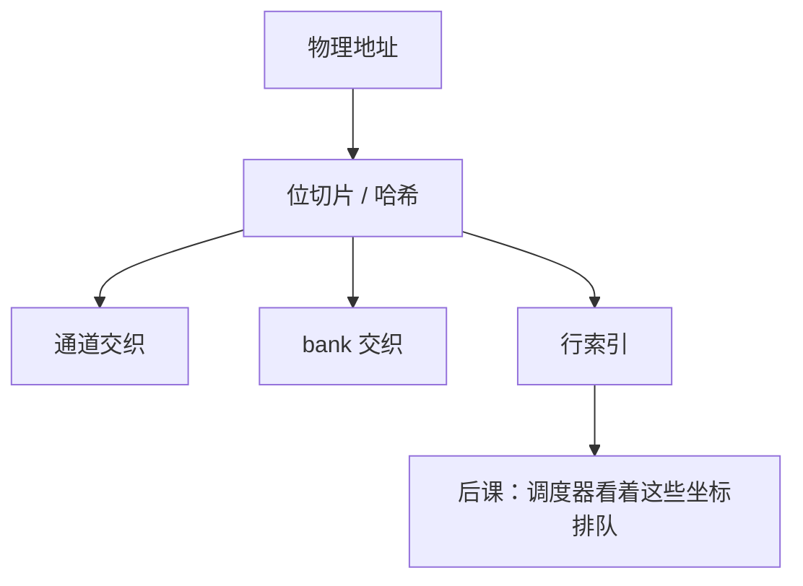

# 地址映射与交织

  
物理地址哪几位当通道、哪几位当 bank、哪几位当行，决定连续 cache 行是打在同一行缓冲里还是洒开并行——这是控制器的译码，不是 ISA 的一部分。

  <footer>—— 据 Hennessy and Patterson, CA:AQA；JEDEC DDR 组织；Patterson and Hennessy, Computer Organization and Design (RISC-V) 整理</footer>

[上一课](/cs/ddr-protocol)能发合法命令了。物理地址还是扁平的。[DRAM 组织](/cs/dram-organization)留下「哪些位选哪一层」。缺口是 **地址映射**：交织（interleaving）如何权衡行命中与 bank/通道并行。

## 问题

cache 行对齐的连续地址：若低位先切列与 bank，相邻行走不同 bank（bank 交织），冲突少、打开页命中也可能少。若低位先切列且同行，空间局部性吃行缓冲，顺序流式好，随机跨行则冲突堆在同一 bank。通道交织把连续块洒到多通道以拉带宽。缺口不是新的 DDR 命令，而是这张**位切片表**是微结构合同，OS 看到的仍是物理页。

XOR 银行哈希减轻步长冲突（如每 256 字节一冲突的列步长）。本课点名，不证哈希最优。

### 映射不是「虚拟内存页表」

页表把 VA→PA；PA 再被内存控制器切成 DRAM 坐标。程序员与 OS 通常不能直接选 bank。把 bank 当成另一种页大小，缺页处理会写错。大页只改变 VA 映射粒度，不自动改变通道交织。

CA:AQA 讨论交错与并行。控制器手册（厂商）给具体位场，本课用教学切片。JEDEC 不规定 CPU 如何把 PA 切到位，只规定颗粒看见的行/列。

## 方法

典型：`PA = [通道 | rank | 行 | bank | 列 | 字节]` 或把 bank/通道放到更低位。cache 行大小应对齐突发。NUMA：高位先选节点，再进本地通道映射。HBM 伪通道是另一套低位切片。

软件：伪随机访问对任何静态映射都可能最坏；结构感知的分配（靠近、对齐）是性能层，不是协议层。

## 机制

FR-FCFS 在给定映射下最大化行命中。换映射等于换调度器看到的冲突图。后课 HBM 把「通道」变宽，映射思想不变。持久内存会把同一 PA 切到另一介质，映射仍先发生。

## 边界

本课不保证某 Intel/AMD 代际的真实位场，不写 RowHammer 地址邻近的完整模型。不把 GPU 显存 tiling 当 DDR 映射定义。

后课默认：PA 到通道/rank/bank/行/列由控制器映射；交织权衡命中与并行。

## 小结

- 页表之后还有 DRAM 坐标译码。
- 低位切 bank/通道 → 并行；低位留同行 → 页模式命中。
- 调度器吃的是映射后的坐标。
- 出处：Hennessy and Patterson, CA:AQA；JEDEC 组织；Patterson and Hennessy, COD。
