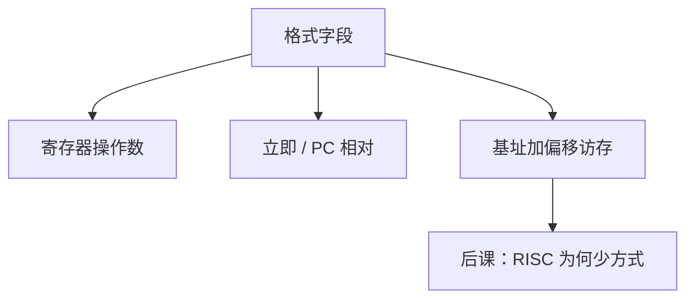

# 寻址方式

操作数可以在寄存器里、在指令的立即数里，或在「基址加偏移」指出的内存里；方式越多，译码与数据通路上的 MUX 越多。

<footer>—— 据 Patterson and Hennessy, Computer Organization and Design (RISC-V)；Harris and Harris, Digital Design and Computer Architecture 整理</footer>

上一课[指令格式](/cs/instruction-format)钉死了 RISC-V 的 R/I/S/B/U/J 字段。本课不重拼立即数位，也不从 x86 的 SIB 字节另起一张总表。缺口是字段对应的**操作数从哪来**：后课 RISC 与 CISC 的分野，很大程度是寻址方式多寡。

## 问题

寄存器寻址：操作数是 `x[rs]`。立即：指令里的常数（已符号扩展）。PC 相对：分支/JAL 的目标。基址+偏移：`lw`/`sw` 的 `x[rs1]+imm`。缺口不是再切 opcode，而是这几种如何接到 ALUSrc、访存地址口。RISC-V 整数核几乎只有这些；没有存储器间接、没有带比例因子的双寄存器寻址。

CISC 常见「一个操作数在内存、带变址」。本课只列对照，不把 x86 模式表抄完——那是下一课的动机。

### 寻址方式不是「虚拟内存页表」

这里的地址是指令算出的有效地址，还没有页表、没有 MMU。[进制](/cs/positional-notation)的字节编址已经够用。把 addressing modes 理解成 OS 的 mmap，会跳过组成。

Patterson/Hennessy 强调 RISC-V 的简单寻址以保持单周期可画。Harris 在数字设计侧把立即数与寄存器当 MUX 输入。本课不讲 PIC 的 GOT。

## 方法

对 RV32I：R 型两寄存器；I 型寄存器+imm（含 `lw` 地址、`addi`）；S 型两寄存器+imm 写存；B/J 的 imm 加 PC。译码只选 ALU 输入与是否访存，不先跑复杂地址状态机。

## 机制

简单寻址让有效地址在一级加法器内算完，塞进[关键路径](/cs/critical-path)。方式一多，就要微码或多拍地址计算——CISC 的组成代价。`x0` 作基址给出绝对地址（零页），仍是基址+偏移，不是新方式。

## 边界

本课不讲向量散射/聚集、不把段寄存器请进来。间接跳转 `jalr` 是寄存器里的目标，仍属寄存器寻址的 PC 更新。

后课默认：RV32I 寻址是寄存器、立即、基址+偏移、PC 相对。下一课用「方式多少」对照 RISC/CISC。

## 小结

- 操作数来源决定数据通路 MUX，不是页表。
- RISC-V 故意只留很少几种寻址。
- 有效地址一级加即可，为单周期铺路。
- 出处：Patterson and Hennessy, COD (RISC-V)；Harris and Harris。
