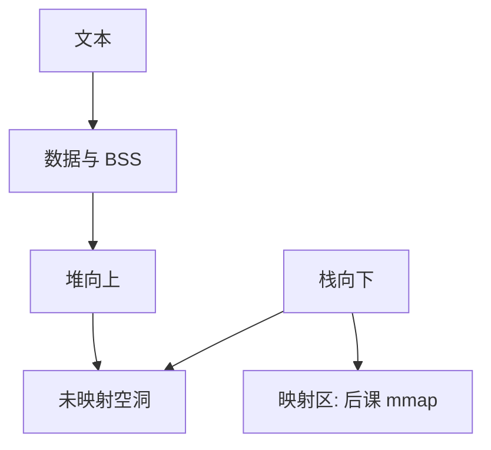

# 地址空间布局

每个进程看见一段自己的虚地址：代码、数据、堆向高处长，栈向低处长；内核通常另有映射。

<footer>—— 据 Tanenbaum and Bos, Modern Operating Systems；Silberschatz et al. 整理</footer>

[上一课](/cs/lock-ordering)把同步与死锁回避收束。[进程映像](/cs/process-image)只说「有一份地址空间」，还没有画出用户虚地址里各段放哪。[分页](/cs/paging-vm)已能把任意虚页接到物理页，本课不重导页表，只规定**布局惯例**。

## 问题

加载器把代码放进内存后，堆从哪长、栈从哪长、共享库映射到哪，若没有约定，编译器生成的绝对地址与 `brk`/`mmap` 会对撞。缺口不是 TLB 怎么填，而是用户空间的分区：只读文本、已初始化数据、BSS、堆、栈、以及稍后的内存映射区。内核空间是否映射进每个进程，是同一张图的上半或另半，本课点名即可。

本课不把 ASLR 的随机化分布写成安全课。

经典 Unix：低地址文本，之上数据与堆，高用户地址栈。Linux 用户/内核分界随架构而变；对象仍是「一段用户可用虚区间」。

## 方法

链接器给出段的虚地址；内核为进程建页表，把合法区间标成可读/写/执行。[加载](/cs/load-dynlink)已谈重定位；本课只要求：堆通过 `brk` 或匿名映射向高地址扩展，栈在故障时可向下扩一页（直到资源上限）。空洞（未映射）访问走缺页异常，下一课才说是立刻分配还是拒绝。

## 机制

布局把「映像」变成可检查的区间集合：栈溢出是碰到守卫页或碰到堆，而不是神秘写坏内核——用户写不进内核页，靠的是分页权限，不是本课新硬件。线程各有栈，仍落在同一布局的不同区间，与[共享地址空间](/cs/thread-shared-addr)一致。

内核映射若出现在每个进程的高半，系统调用路径上内核才能用自己的指针；用户仍不可执行那些页上的内核代码当用户指令。

## 边界

本课不引入 32 位 3G/1G 与 64 位 canonical 地址的全部数字，不把 vsyscall 页写进主干。也不把文件映射的空洞策略提前：那是 mmap 课。安全栏的 NX 与 ASLR 用本课的段权限当前提，本课不讲攻击。

共享库的 PIC 文本可被多进程映射到不同虚地址；物理帧仍可共享，这是后课 mmap 的伏笔。

后课默认：用户虚空间有文本、数据、堆、栈和空洞。空洞何时因访问而变成有效页，下一课按需调页。

## 小结

- 进程映像的虚地址按段布局；堆与栈相对生长。
- 页表权限执行布局；本课不重导页表。
- 未映射页的补页策略是按需调页的缺口。
- 出处：Tanenbaum and Bos, *MOS*；Silberschatz et al., *OSC*。
