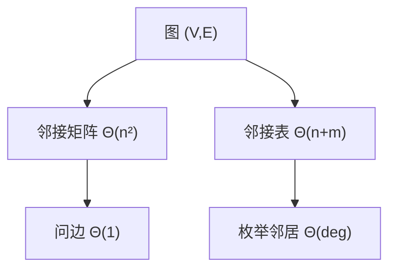

# 邻接表与邻接矩阵

图已经在离散课里定义；现在才选表示：矩阵用 $\Theta(1)$ 问边，表用 $\Theta(\deg)$ 枚举邻居。

<footer>—— 据 Cormen, Leiserson, Rivest and Stein, Introduction to Algorithms 整理</footer>

[上一课](/cs/uf-rank-compress)能维护连通分量，却存不下边集。[图的定义](/cs/graph-definition)已有顶点与边，当时没有布局。[数组与随机访问](/cs/array-random-access)和[链表与局部性代价](/cs/linked-list-locality)现在可以当零件。本课不重讲图的无环定义。缺口是两种标准表示：邻接矩阵与邻接表，以及它们把哪些操作写成 $\Theta(1)$ 或 $\Theta(\deg(v))$。

## 问题

ADT 层面图要：加点/边、问 $(u,v)$ 是否有边、枚举 $v$ 的出边。矩阵 $A[u][v]=1$ 让询问 $\Theta(1)$，空间 $\Theta(n^2)$，枚举一行 $\Theta(n)$ 即使度数是 1。表：每个 $v$ 一条邻居列表，空间 $\Theta(n+m)$，枚举 $\Theta(\deg(v))$，询问 $(u,v)$ 要扫 $u$ 的表除非再加散列。

缺口不是「图是什么」，而是**按将要做的操作选表示**。后课稀疏图会把 $m\ll n^2$ 写成默认假设。

有向图用出边表；无向图每边存两次。权放在矩阵项或表节点上。

## 方法

矩阵： $n\times n$ 数组，适合稠密或需要快速边查询、乘法。表：数组 of 链表或动态数组，适合遍历。混合：表加边散列，两边都 $\Theta(1)$ 期望，空间仍 $\Theta(n+m)$。

与[局部性原理](/cs/locality-principle)：矩阵一行连续；链表邻居再追逐。邻居用动态数组则枚举吃空间局部性，删除边要另议。

## 机制

算法复杂度必须带着表示写：DFS 在表上 $\Theta(n+m)$，在矩阵上 $\Theta(n^2)$。同一伪代码，表示换了渐近就换。这是 ADT 课「合同含代价」在图上的落地。

并查集仍可并行维护分量，但不替代边表：Kruskal 要扫边列表，那份列表才是 $E$ 的表示。

## 边界

本课不引入 CSR/CSC 压缩格式以外的科学计算细节，不把图数据库当正文。也不开始拓扑排序——DAG 下一课才限制边的方向无环。

后课默认：谈到图算法，先声明表还是矩阵。$m$ 与 $n^2$ 差一个数量级时，表是默认。

## 小结

- 矩阵：问边快，空间 $n^2$，枚举按 $n$。
- 表：空间 $n+m$，枚举按度数，问边要扫或加索引。
- $m$ 很小时的默认选择与 CSR，下一课稀疏图。
- 出处：Cormen et al. 第 22 章表示一节。
