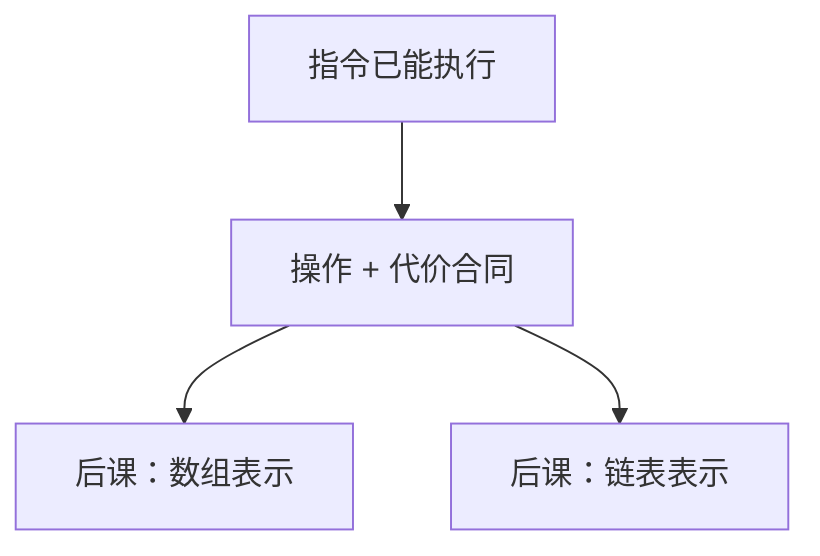

# 抽象数据类型

先约定对象上允许哪些操作以及它们的代价，再选一种比特布局去实现；布局可换，合同不能偷换。

<footer>—— 据 Liskov and Zilles, Programming with Abstract Data Types, SIGPLAN 1974；Cormen, Leiserson, Rivest and Stein, Introduction to Algorithms 整理</footer>

[上一课](/cs/dram-timing)把指令、cache、一致性和远程内存都收进可执行的机器：比特已经能算、能存、能在核间可见。本课不重讲 MESI，也不从「计算机是什么」另起。缺口是：还没有给**可复用的布局**命名——栈、表、图在 ISA 里都只是 load/store。[比特作为区分](/cs/bit-as-distinction)给出串，[渐近记号](/cs/asymptotic-notation)给出步数怎么写。本课只钉抽象数据类型：操作集合加代价，实现另选。后课默认已经读完本课。

## 问题

体系结构课结束时，程序员仍每次用手排寄存器和地址。同一套「后进先出」可以是数组顶指针，也可以是链表，调用约定已经用过其中一种，却没有把它写成可替换的合同。缺口不是新的特权级，而是把对象从具体指令里抽出来：**构造、插入、查找、删除各允许做什么，最坏或摊还各多少步**。

没有这层，后课无法比较数组与链表：它们会混成「都是一串元素」。代价必须进合同，否则局部性与 $O(1)$ 下标会被说成同一件事。

ADT 不是 OOP 课。Liskov 强调的是接口与表示分离；本栏用它连接 ISA 与 CLRS 里的结构。

## 方法

指定一个对象类型 $T$ 和有限个操作，每个操作给出前置条件与渐近代价（最坏、平均或摊还，须声明）。正确性相对抽象状态（序列、集合、全序映射），不相对某次 `sw` 的地址。同一 $T$ 可以有多种表示，后课逐个给。

本课不引入任何一种具体结构的不变式细节。只要求：换表示不得偷偷改合同——若查找从 $O(1)$ 变成 $O(n)$，那是另一种 ADT 或另一种实现承诺。

## 机制

有了合同，[局部性原理](/cs/locality-principle)变成实现层的注释：同一「取第 $i$ 个」在数组上吃空间局部性，在链表上可能每次 cache 缺失。渐近记号数的是步，步的常数含命中与缺失；后课会把两者拆开写，但合同先写步数。

NUMA 上远程节点是又一层常数。ADT 课默认分析单处理器 RAM 模型，需要时再加一句「布局破坏局部性则常数爆炸」，不把每课重写成体系结构。后课的每一种结构，都先写合同再写一种表示，不从晶体管另起。

## 边界

本课不把类、继承、虚函数请进来。也不把「抽象」写成无代价：没有代价的接口无法在后课做选择。形式化代数规范（ADT 作为等式理论）不在主干。

后课默认：谈到栈、队列、字典、图，先有操作与代价，再谈表示。第一份表示是数组。

## 小结

- 机器会执行了；本课开始命名操作合同，而不是某次 load 的地址。
- ADT = 操作 + 代价；表示可换，合同不可偷。
- 数组随机访问是下一课的第一种表示。
- 本课不把类与继承请进来；没有代价的接口无法选择表示。
- 出处：Liskov and Zilles, 1974；Cormen et al., *Introduction to Algorithms*。
