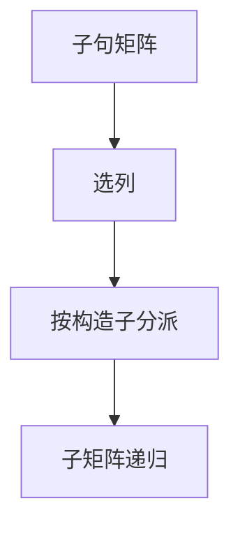

# 代数数据类型与模式匹配编译

和类型是带标签的不交并，积类型是字段。模式匹配应编译成对标签的判定树，而不是层层 `if` 的朴素展开。

<footer>—— 据 Augustsson, Compiling Pattern Matching, 1985；Peyton Jones, The Implementation of Functional Programming Languages；Appel 整理</footer>

上一课[类型类](/cs/typeclass-dictionary)解决操作的重载。缺口是**数据**：代数数据类型（ADT）`data T = A Int | B` 与模式匹配。主干类型检查有结构体/联合的表面；本课钉标签、装箱与匹配编译。穷尽性下一课专门查；本课假定人写的子句先能编成树。

## 问题

朴素：每条子句从上到下尝试，失败回溯。指数与重复测试。Augustsson / Peyton Jones：按列选构造子，生成 switch（或跳表），再递归编译子模式。缺口是**判定树**，不是再定义和类型的引入消去（那是 STLC 的延伸，Pierce 有和与积）。

表示：空构造子可只留标签；一个指针字段可与标签一起编码（如 GHC 的指针标记）。这是运行时，影响匹配的比较方式。

### 模式不是正则词法

模式在值的树上匹配，有绑定与嵌套。不要用 lex 的最长匹配当模式语义。守卫（guard）是匹配成功后的布尔，失败则下一条——判定树要留失败边。

Augustsson 1985。Peyton Jones 的实现书。Maranget 的论文同时服务编译与后课穷尽性。Appel 的 ML 章有短实现。

## 方法

把子句矩阵化：列是参数位置。选列：构造子种类多的、或能立刻失败的。生成：对已知标签分派；通配与变量推迟绑定。变量绑定变成对字段的投影。

与[SDT](/cs/syntax-directed-translation)：前端把 `match` 建成核心 case 树；本课是中端前的 lowering。

## 机制

共享失败：多条子句的默认边可合并。惰性语言还要考虑匹配的严格性（哪一列先求值），这会改变未定义行为与异常顺序——Haskell 有规则；严格语言简单些。

不要把嵌套模式降成用户层的 `if` 链还声称已优化；判定树才是编译。

## 边界

本课不写 GADT 的细化类型。后课默认：match 降为标签分派树。下一课穷尽与无用子句诊断。

也不把面向对象的 visitor 当 ADT 的唯一实现；visitor 是另一编码（表达式问题的另一侧）。

## 小结

- ADT = 标签和 + 字段积；匹配编译成判定树。
- 子句矩阵按列分派，避免朴素回溯。
- 表示（标签、指针标记）影响比较。
- 出处：Augustsson, 1985；Peyton Jones；对照 Appel。
