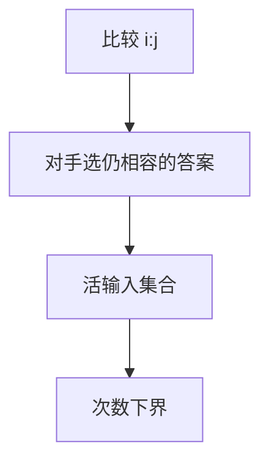

# 对手论证

下界不必列出所有输入：对手在比较时才固定答案，只要与某个尚未排除的输入一致，就逼算法问够多次。

<footer>—— 据 Knuth TAOCP 卷 3；CLRS 第 8.1 节排序下界整理</footer>

上一课[排序网络](/cs/sorting-networks)是上界构造。比较排序 $\Omega(n\log n)$：决策树叶子 $\ge n!$，$\log_2(n!)=\Omega(n\log n)$。缺口是对手法：求最大与次大 $n+\lceil\log n\rceil-2$ 次比较等。不重写主定理。后课 word RAM 换模型。主干[排序下界](/cs/sort-lower-bound)若已写则只补对手图像。

## 问题

算法问「$a_i?a_j$」，对手选 $<$ 或 $>$ 使尽可能多输入仍活。直到只剩一种序或一种最大。求最大：$n-1$ 次必要（锦标赛）。次大：败给冠军的人里再赛，$\lceil\log n\rceil-1$。信息论：中位数、极值都有对手或决策树界。

缺口是自适应对手，不是「最坏数组已经写好」。

### 不是在线竞争的对手

那里对手生成序列对付在线决策。这里对手回答比较。模型不同，精神同：延迟承诺。

CLRS 8.1 决策树。Knuth 卷 3 对手。后课 word RAM 打破比较模型。

## 方法

维护尚未排除的输入集合或不变量（谁仍可能最大）。每次比较缩小，给出最少次数。与决策树高度对照。

线性时间排序靠非比较模型（桶、基数）。

## 机制

活集合大小每问最多减半（平衡时），故 $\log$；排序活集合 $n!$。对手可不平衡提问，下界仍至少最坏路径。与 Karger 对手无关。与分页对手是在线。

## 边界

本课不写代数判定树全文。不写元素唯一性 $\Omega(n\log n)$。后课默认：比较模型下界用决策树或对手。下一课 word RAM 与位并行。

## 小结

- 对手延迟固定输入，逼出比较次数。
- 排序 $\Omega(n\log n)$；最大 $n-1$。
- 与在线对手模型不同。
- 出处：Knuth TAOCP 卷 3；CLRS 第 8.1 节。
