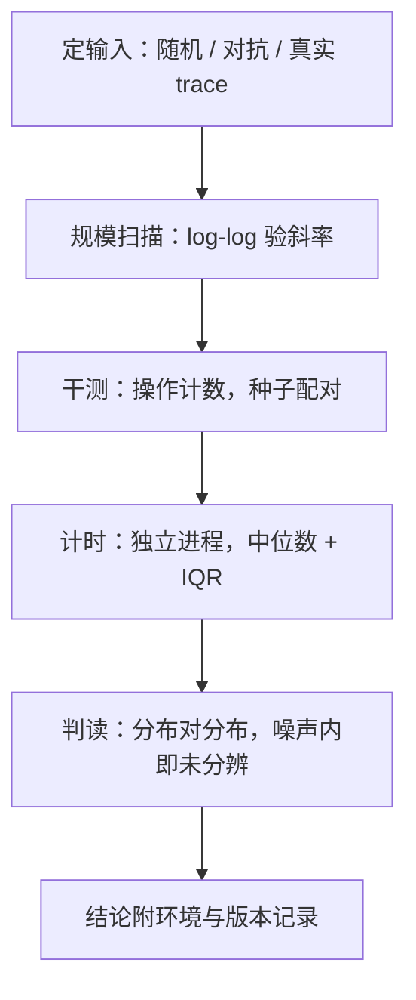
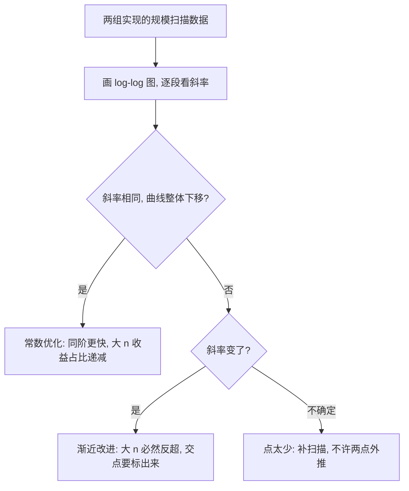

# 算法基准的方法

一个不带方差的数字不是测量，是轶事；算法比较输给环境变量的次数，比输给彼此的次数多。

<footer>—— 据 Mytkowicz et al., ASPLOS 2009；Georges, Buytaert, and Eeckhout, OOPSLA 2007 整理</footer>

[上一课](/cs/ae-randomized-practice)把随机算法的验证押在「同一组种子配对」上；配对为什么减方差、除此之外还要钉住什么，本课给全课程的验证纪律：怎么测一个算法改动，结论才配写进代码评审。前四课的每个杠杆——选型、常数、布局、位运算、随机化——最后都由这里的数字裁决。

## 问题

基准的噪声源比被比较的差距还大：CPU 频率迁移、缓存与分支预测器的状态残留、后台任务，乃至环境变量表的大小与链接顺序——2009 年那篇 ASPLOS 论文证明这些「明显没错」的因素能造成成倍差异。另一类错误更根本：输入分布选错——用随机数组测自适应排序、用近乎有序的数据测哈希，精确地测着一个不存在的负载。单次运行下结论、不报方差、两个实现在不同机器或编译选项上比、只测一个规模就用两点外推渐近，每一条都在评审里见过。

术语翻译：IQR（四分位距）就是用「切掉最低四分之一和最高四分之一后量剩下那段的宽度」的手段来做「不被极端样本绑架地报告波动」的事。它对离群值不敏感——一个 145 ms 的毛刺拉不宽 IQR，却能把均值拽高一大截。

## 方法

定输入。三种都要有：随机（平均水平）、对抗（最坏情况验收）、真实 trace（部署预期），分布写进实验记录。规模做扫描，不取孤立点：log-log 图上斜率对得上理论阶（见[渐近记号](/cs/asymptotic-notation)），才算真懂了这条曲线。

定测量。随机算法先干测操作计数（种子配对，[摊还分析](/cs/amortized-analysis)式的记账口径），wall-clock 只作最后一步；计时用多个独立进程，报中位数与四分位距。

定环境。锁频率或记录频率、绑核、预热与冷测分开；编译选项与库版本写进结论——换任何一项，结论作废重跑。

定判读。比较的是分布，不是两个数：差距小于噪声区间就写「未分辨」，不许写成胜负。

## 机制

为什么中位数与四分位距：性能分布常是多峰——垃圾回收与频率迁移把样本堆成两个稳定模式，均值可能落在两个峰之间无人到达的位置；中位数对应真实工作模式，四分位距暴露离散度。为什么独立进程：同进程里上一轮留下的缓存内容、分支预测器状态与分配器布局会喂养下一轮，序贯复用进程的测量互相污染。为什么扫描能区分两类优化：常数优化平移曲线，渐近改进改斜率，两点测量既分不出这两者，还会把拟合外推成笑话。为什么种子配对减方差：配对差把共同的输入项消掉，剩下的方差只来自硬币——这是上一课留下诺言的兑现。

Mytkowicz 等 2009 的标题即结论：「没做任何明显错误的事，却产出错误数据」——同一份代码，仅环境变量表大小或链接顺序不同，测得的性能差可达数倍。算法比较先赢下环境，再谈输赢。

方法一节的图回答「一次基准按什么顺序做」，下面这张回答另一个问题：拿到扫描数据后，怎么区分「常数优化」和「渐近改进」这两种截然不同的赢法。

数字实例：十次运行得到 98、99、99、100、100、100、101、102、140、145 ms——均值约 108，被两个毛刺拉高了 8%；中位数 100 才是真实工作模式。报「中位数 100 ms、IQR 约 2 ms」远比只报一个「平均 108 ms」诚实。

常见误区：初学者看到「平均快了 3%」就宣布赢家；若这 3% 落在四分位距重叠的噪声区间里，正确结论是「未分辨」。另一个误区是拿两个规模点外推渐近——像量了 6 岁和 7 岁的身高就线性推算成年身高，发育拐点一改斜率，外推就成了笑话。

## 边界

微基准测的是片段；真实负载下的分配与调用模式是另一个系统，外推必须声明。为基准过拟合——对 benchmark 的输入特化、预取正好命中的数据——是作弊不是优化，评审要能识别。基准不替代正确性测试：快而错没有意义，随机算法的边界用例照钉。本课只管「一次比较的效力」；持续的性能监控、线上回归与容量，是性能工程案例课的主题，此处不展开。

## 小结

- 三定先行：定输入分布、定测量协议、定环境；结论里写环境，否则不可复现。
- 随机算法先数操作再计时，种子配对消掉输入项的方差。
- 报中位数与四分位距；差距落在噪声区间内写「未分辨」，不判胜负。
- 规模扫描区分常数与渐近：平移对斜率，两点外推不可信。
- 出处：Mytkowicz et al., *Producing Wrong Data Without Doing Anything Obviously Wrong!*, ASPLOS 2009；Georges, Buytaert, and Eeckhout, OOPSLA 2007。
