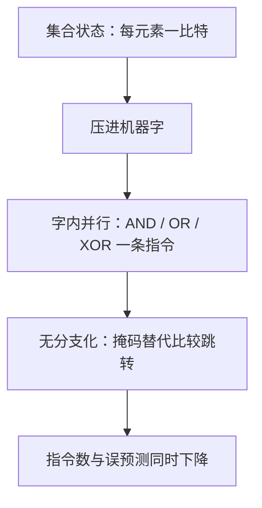

# 位运算技巧

一个机器字是 $w$ 个并行的比特处理器；把状态压进字里，指令数才配得上字宽。

<footer>—— 据 Knuth, The Art of Computer Programming, Vol. 4A；Warren, Hacker's Delight, 2002 整理</footer>

[上一课](/cs/ae-cache-friendly)把字节摆近了，本课钻进字内部。主干课的[word RAM 与位并行](/cs/word-ram)已经证明字宽可以是理论资产：一次处理 $w$ 比特，比较模型的下界都被撬动。本课收工程上最常用的那批字内技巧——置位清位、取低位、子集枚举、无分支化——以及它们赖以成立的补码与移位语义。

## 问题

一批高频小操作，朴素写法全是循环与分支：数一个字里有几个 1，逐位右移 $w$ 次；找最低位的 1，先判零再移；取两数较小者，一个比较分支；枚举集合的子集，逐个加一再筛位数。缺口：这些操作全部可以在常数条字指令内完成，而它们常出现在最热的循环里——压缩、棋类走法生成、哈希与图算法的位集。不这么做会错在两处：不查语义就上手，有符号左移与超宽移位是未定义行为，可移植性碎掉；或者为炫技全套位运算化，reviewer 读不懂，正确性无从把守。

## 方法

清最低位的 1 用 `x & (x-1)`：借位恰好把最低的 1 及其右侧归零。数 1 的个数（popcount）因此可写成「循环执行 $x\ \&=\ x-1$，次数即 1 的个数」；硬件更直接，x86 有 POPCNT，AArch64 有 CNT 与 CLZ（见[ARM AArch64](/cs/aarch64-isa)），工程上优先内建指令。

取最低位的 1 用 `x & (-x)`（lowbit），它是补码等式 $-x=\bar{x}+1$ 的直接推论。由它派生子集枚举：Gosper's hack 从一个 popcount 为 $k$ 的字直接跳到下一个同为 $k$ 位 1 的字，枚举 $n$ 元集合的全部 $k$ 元子集只需 $\binom{n}{k}$ 步而非 $2^n$ 步筛。

定位最低 1 的位置：把 lowbit 孤立后用 de Bruijn 乘法映射到查表下标，或直接用 CTZ/CLZ 指令。无分支化：min、max、abs 写成掩码算术，消掉数据依赖分支——接上一课的账，省的不是指令条数而是误预测。

## 机制

为什么有效：一条字指令同时处理 $w$ 比特，位技巧把「按元素循环」折叠成「字内并行」——这正是 word RAM 模型的工程面，也解释了为什么棋类 AI 把整盘 64 格压成一个 64 位字后，走法生成变成几条 AND 与移位的表达式。补码为什么撑得起 lowbit：$\bar{x}+1$ 恰好把 $x$ 最低 1 以下的所有位变回原样，于是在最低 1 的位置上两者同为一，其余位上互补，按位与只留下它。无分支为什么快：分支的代价不在比较指令本身，而在预测错误的十几周期罚金；掩码路径没有预测可言，延迟恒定，对随机输入尤其值钱。

Gosper's hack 两行：`c = s & -s; r = s + c; s' = (((r ^ s) >> 2) / c) | r`。它出自 HAKMEM（MIT AI Memo 239, 1972）第 175 项；注意推导在 $c=0$（空集）时无意义，调用前必须先判空——位技巧的 bug 常藏在边界，不在主干。

## 边界

语义先于速度：有符号数左移、移位计数超字长，在 C/C++ 里是未定义或实现定义行为，位技巧默认用无符号类型并把移位量约束在字宽内。编译器已认得一部分模式，popcount 与低位定位优先内建与标准函数，手写只在没有对应指令的旧平台上划算。位并行按「一个字一打包」工作，宽度到顶之后再加宽的是 SIMD 的通道并行，见[SIMD 与向量化](/cs/par-simd-vectorization)；那是另一套语义，不要混写。可读性预算同前两课：每处位运算配一行「它是谁」的注释，测试钉住 0、全 1、最高位三个边界。

## 小结

- 位技巧的本质是字内并行：一条指令处理 $w$ 比特，word RAM 的工程兑现。
- 三件套：`x&(x-1)` 清低位、`x&(-x)` 取 lowbit、Gosper's hack 跳下一个同位数子集；有硬件指令（POPCNT/CLZ）时直接用。
- 无分支化省的是误预测的方差，不是指令条数，对随机数据尤其值钱。
- 语义先于速度：无符号类型、移位边界、空集特判，否则未定义行为。
- 出处：Knuth, *TAOCP* Vol. 4A；Warren, *Hacker's Delight*, 2002；HAKMEM, MIT AI Memo 239, 1972。
