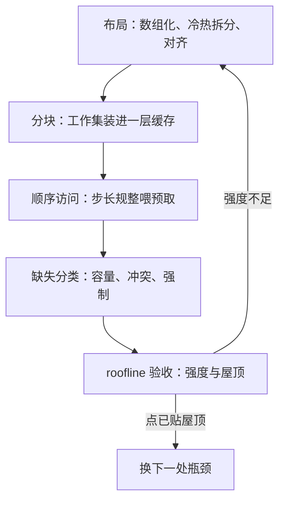

# 缓存友好的算法

让计算变快的上限是屋顶，让数据变近的收益是斜率；很多时候该省的不是乘加，而是搬运。

<footer>—— 据 Williams, Waterman, and Patterson, CACM 2009；Drepper, What Every Programmer Should Know About Memory, 2007 整理</footer>

[上一课](/cs/ae-constant-optimization)把常数拆成指令数与每指令成本，但那笔账里藏着常最大的一个成本项：访存。寄存器与 L1 以个位周期计，DRAM 以几百周期计；同一份算法，摆数据的姿势不同，时间能差出一个数量级。本课把「缓存友好」写成可操作的三件事——布局、分块、顺序访问——并接上[roofline 的深化与收束](/cs/par-roofline-map)那幅屋顶图：算术强度不够时，缺的不是算力而是字节。

## 问题

指令数已经压过的代码仍然慢，原因有三类。指针追链：链表与树每次解引用都可能 miss，地址在下一次访问之前未知；错序遍历：矩阵按与存储序不匹配的方向扫，每一步都换行失效，空间局部性全丢；布局错位：结构体数组让热循环把整条结构体扛进缓存却只用一个字段。[缺失分类](/cs/cache-miss-types)给了词汇：这里的对象主要是容量与冲突缺失，而它们不是常数——miss 的价格随层级差百倍，且能被算法改写。不这么做会错在哪：只盯着乘加计数做优化，却在每次迭代里付一次 DRAM 访问，省下的那几条指令根本不够填坑。

## 方法

第一件事，紧凑布局。把指针结构换成数组下标：隐式堆、数组化的邻接表，孩子与邻居就是一段连续内存；热字段与冷字段拆开，让热循环只装它要的字节；[对齐与非对齐访问](/cs/alignment-access)决定一行缓存装得下几条记录，padding 不是小事。

第二件事，分块（tiling）。矩阵乘按缓存大小取块，让一块数据装入后被算够本再换下一块；[循环不变式](/cs/loop-invariant)式的复用在数据上的对应物就是「复用装入缓存的那份字节」。同样的原理写进结构：B 树节点做成一页、二叉堆用隐式数组布局，都是把「子问题恰好装进一层缓存」铸进数据结构。

第三件事，顺序访问喂预取器。硬件预取器认固定的步长；顺序扫描几乎免费，乱序与链式访问让它哑火，见[预取](/cs/cache-prefetch)。

最后用递归分块收尾：[缓存无关结构](/cs/cache-oblivious)让同一份代码在各层缓存上都自动分块，免去按机器调参。

## 机制

miss 为什么主导：一次 DRAM 访问约两百到三百周期，够做几百次浮点乘加。算法强度（每字节几次运算）低于脊点 $I^{*}=F/B$ 时，程序贴在带宽斜线上，SIMD 与多核都抬不动它——这正是屋顶图给出的判决，也是向量化要求规整布局的原因（见[SIMD 与向量化](/cs/par-simd-vectorization)）。分块为什么成立：装入成本被块内的重复计算摊薄，强度上升，工作点右移；经典结果是分块把矩阵乘的缺失从 $\Theta(n^3)$ 压到 $O(n^3/\sqrt{M})$（$M$ 为缓存可容纳的元素数）。顺序访问为什么便宜：预取把 miss 藏进计算后面，等效延迟趋近 L1；换成本质是每元素一次访存对一次顺带装载。

直觉账（Drepper 2007 的口径）：L1 命中约 4 周期，DRAM 约 200–300 周期。8 字节指针的链表换成连续数组后，遍历常快 5–10 倍——不是玄学，是把每元素一次不可预取的访存，换成一次顺带预取的顺序流。

## 边界

本课不写 SIMD 指令本身，那是[SIMD 与向量化](/cs/par-simd-vectorization)的事；但次序不能反——先有规整布局，向量化才有资格发生。分块参数依赖机器：写死的块大小换台机器就不再最优，取值要靠基准课的纪律测定；缓存无关结构免去调参，代价是更大的常数。多核共享缓存下的争用、NUMA 上的摆放，属并行课程，本课不展开。渐近阶不动是前提：缓存友好改善的是同一阶下的常数，把 $\Theta(n^2)$ 改成 $\Theta(n\log n)$ 仍然是选型课的事。

## 小结

- 常数账的最大项常是访存：miss 以百周期计，乘加以周期计，先看强度再谈指令。
- 三件事：紧凑布局（数组化、冷热拆分、对齐）、分块提强度、顺序访问喂预取器。
- 分块把矩阵乘缺失从 $\Theta(n^3)$ 压到 $O(n^3/\sqrt{M})$；「节点装进一页」是同一原理的结构化。
- roofline 是验收标准：强度不足时，SIMD 与多核都上不去。
- 出处：Lam, Rothberg, and Wolf, ASPLOS 1991；Frigo, Leiserson, Prokop, and Ramachandran, FOCS 1999；Drepper 2007。
