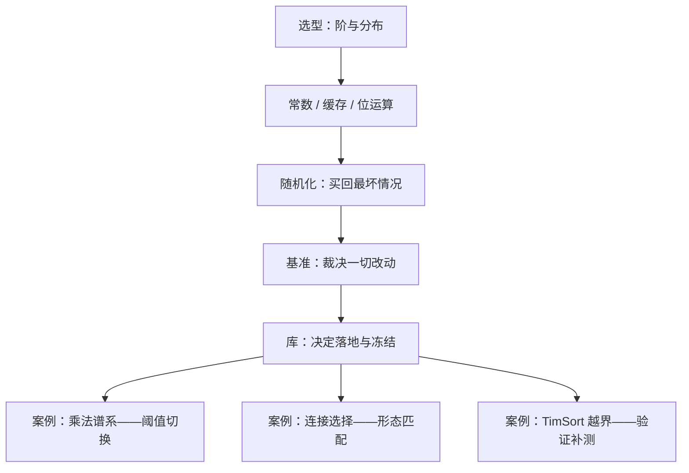
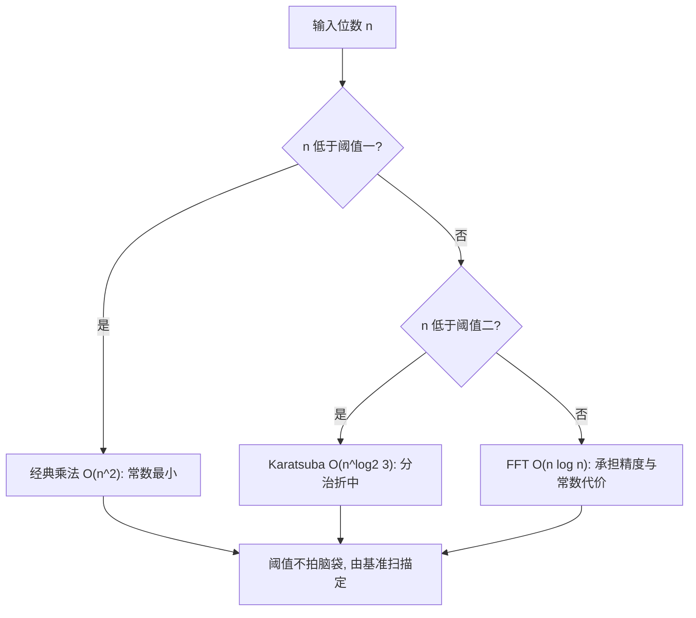

# 算法工程案例与收束

工程里没有纯算法：每个被部署的算法，都带着数据、机器与团队的签名。

<footer>—— 据 Bentley, Programming Pearls, 2000 整理</footer>

[上一课](/cs/ae-library-comparison)把库的化石拆开看后，本课程走到收束。本课把前七课的杠杆放进三个案例——大整数乘法的谱系、数据库连接的选择、一次排序库 bug 的追查——看它们如何叠加生效，并回答第一课留下的问题：一个算法决定是怎样被做出来的。本课程到此收束，树序后续由附录的文献对照接走。

## 问题

案例课的问题只有一个：杠杆怎么组合、次序对不对。错法是把杠杆并列乱用——还没定输入规模与分布就埋头压常数，还没跑基准就先信库，出了性能问题先改代码而不是先固定输入。三个案例各给一遍正确的次序。

常见误区：初学者容易以为「渐近更优的算法在任何规模都更快」。实际上 FFT 的每次运算常数是普通乘法的十倍上下，输入只有几百位时用它反而更慢——所以成熟库都在阈值之下保留经典乘法，「更小的阶」是要靠规模换的。

## 方法

案例一，乘法谱系。大整数乘法的教科书基线是 $O(n^2)$；[Karatsuba](/cs/karatsuba) 用分治把指数压到 $O(n^{\log_2 3})$，[FFT](/cs/fft) 再压到 $O(n\log n)$ 但带来精度与常数代价。成熟的高精度库不二选一：按操作数规模在多级算法间切换，切换阈值由基准扫出，阈值之下仍用经典乘法吃常数，大块乘法的速度又由分块布局决定。选型给骨架，常数、缓存、基准给肉。

案例二，连接的选择。数据库优化器按统计信息在嵌套循环、[排序归并连接](/cs/sort-merge-join)、哈希连接之间挑：输入恰好已按索引有序时，归并连接免一趟排序，赢在「分布与布局」而非渐近阶——这正是第一课「分布改变题目」的工业化版本，第三课的顺序访问红利顺手落袋。

案例三，库的 bug。2015 年，形式化验证发现 Java 的 TimSort 在特定输入下可触发数组越界，修复进入 OpenJDK。追查路径全在课程里：对抗与随机输入构造（随机化一课的对手视角），复现靠种子、输入与版本归档（基准一课的纪律），修复后又回到库对照的保证清单（上一课）。库不是正确性的终点，测量也不只是测快。

## 机制

杠杆叠加的次序：先选型定阶与分布，再布局与常数压同一阶下的成本，再随机化把最坏情况买掉，最后基准裁决、库把决定落地并冻结。次序反了的代价可以直接算：先压常数，可能在错误的阶上白干——$O(n^2)$ 省一半常数追不上换一次阶；先信库，可能连输入分布的假设都错了——用随机数据给自适应排序打分是白打。三个案例共有的机制是换币：每一层杠杆把上一层留下的剩余差距换成另一种货币——阶与分布换给常数，常数换给测量，测量最后换给维护决策；收束时剩下的差距（TimSort 的越界）不在任何性能货币里，而在正确性验证的账户上。

de Gouw 等 2015 发现的不是理论瑕疵，而是真实输入可触发的越界异常，藏在 galloping 搜索与 run 栈不变量的组合里。形式化验证与工程基准是互补的探针：一个找「错的输入」，一个量「慢的路径」——收束课各钉一行。

方法一节的图回答「五个杠杆按什么次序串联」，下面这张回答另一个问题：案例一的乘法谱系，库在实际运行时怎么按规模挑算法。

数字实例：$n=10^6$ 位时，$O(n^2)$ 是 $10^{12}$ 次基本运算，$O(n\log n)$ 约 $2\times 10^7$ 次蝶形——差五万倍，FFT 完胜；$n=100$ 时是 $10^4$ 次对约 $700$ 次蝶形，后者单次贵十倍，实际持平——两条曲线的交点就是阈值，交点位置随机器变，所以要扫出来。

直觉类比：杠杆次序像装修——先定户型（选型：阶与分布），再挑建材与工法（常数与缓存），验收时拿实测说话（基准），最后交钥匙入住（库落地）。户型错了再贵的地板也救不回来；没验收就入住，TimSort 那样的越界就藏在墙里。

## 边界

本课程不覆盖并行与外存算法（各有专课），不重推渐近证明（主干课的事）；案例里的库行为随版本漂移，引用结论要带版本号。算法工程没有终局：规模、分布、硬件任一漂移，第一课的四问重新开问。收束即循环的入口。

## 小结

- 杠杆有次序：选型定阶与分布，布局与常数压成本，随机化买最坏情况，基准裁决，库落地。
- 乘法谱系：渐近阶梯是骨架，台阶上的切换阈值与常数由基准和布局填肉。
- 连接选择：赢的是与数据形态匹配者，不是渐近最优者。
- TimSort 越界：库不是正确性终点，复现靠种子、版本与对抗输入。
- 本课程到此收束：规模、分布、硬件再漂移时，四问重开。
- 出处：Bentley, *Programming Pearls*, 2000；Musser, 1997；de Gouw, Rot, de Boer, Bubel, and Seifert, 2015。
