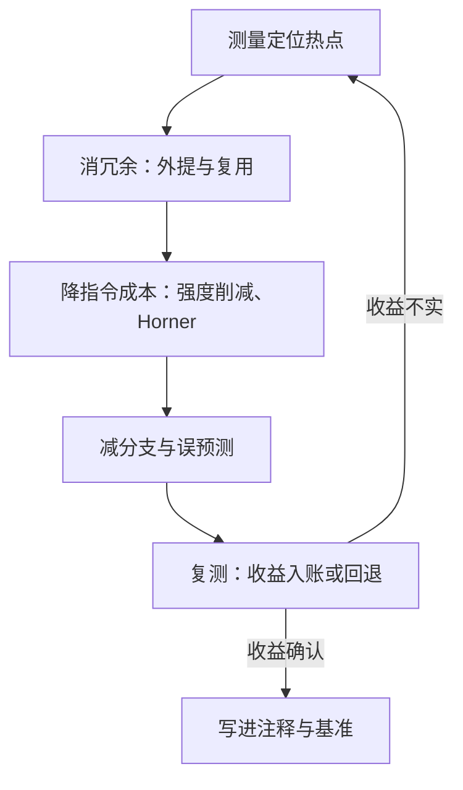
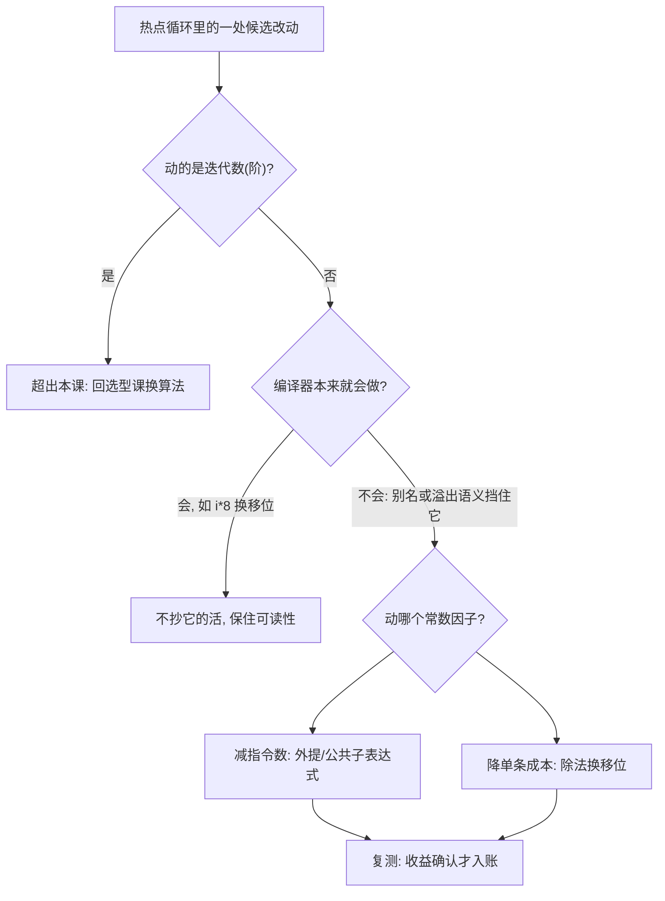

# 常数优化

对那 3% 值得优化的代码，程序员不应放弃任何一个常数；难处从来不在省，而在知道哪 3% 值得省。

<footer>—— 据 Knuth, Structured Programming with go to Statements, 1974 整理</footer>

[上一课](/cs/ae-selection-engineering)把选型钉在四问与交叉点上：阶定下来之后，剩下的战场就是常数。同一算法类的两条实现，实测可以差五到十倍——本课处理的就是这个差距。立场先立好：先测量后动手，热点在哪、常数由什么构成，profiler 说了算；然后按「减指令数、降单条指令成本、减分支」三层把冗余剥掉。后课默认你已带着这条测量先行的纪律。

## 问题

常数从哪来：每条源语句展开成若干条指令，而指令之间延迟与吞吐差着量级；其上再叠冗余计算——重复求值的子表达式、循环内不变的外提物、本可移位代换的除法。缺口是：在不动渐近阶的前提下，把每迭代指令数与每指令平均成本压下来。不这么做会错在两个方向：凭直觉重写，把编译器本来就会做的代换手工抄一遍，白丢可读性；或在真正的热点上做了修改却不复测，把噪声当成收益，优化效果从此成了传说。

术语翻译：强度削减就是用「便宜运算的组合」来替换「贵运算」——除以 8 换成右移 3 位，对 8 取模换成与 7 按位与，乘 64 换成左移 6 位。省的不是阶，是把一条 20 多周期的指令换成一条 1 周期的指令。

## 方法

第一步，测量定位。profiler 与操作计数器找出被反复执行的核心循环，只有它配得上手工改动；先干测（数操作）再计时，收益归因才有依据。

第二步，消冗余。循环不变量外提：不随迭代变的计算挪到循环外，判据正是[循环不变式](/cs/loop-invariant)「每轮前后都成立、循环结束时可用的那部分」；公共子表达式只算一次；循环内不变的小函数调用内联或挪出。

第三步，降单条指令成本。强度削减：乘除换移位与加减；多项式求值用 Horner 法 $p(x)=a_0+x\,(a_1+x\,(a_2+\cdots))$，把每项两次乘法降为每阶一次乘一加，$n$ 阶多项式从 $2n$ 次乘降到 $n$ 次。除法与取模是最贵的常规整数运算，除以常数时换成移位与掩码。

第四步，减分支。深度流水线上一次误预测罚十几到二十个周期；高度可预测的分支留着不动，数据依赖的极值与符号判断改写成无分支形式——具体技巧留给位运算一课。

## 机制

常数可写成三因子：每迭代指令数、每指令平均成本、迭代数。消冗余减第一个因子；强度削减与分支改造减第二个；渐近阶钉死第三个。这套账解释了优先级：迭代数是阶的事，上一课已定；剩下的两层里，减一条昂贵指令（除法）通常胜过省三条便宜指令（加法）。

现代编译器在基本块内已经做强度削减与外提，所以人手该做的是它跨不过去的那部分：别名不确定时它不敢外提，溢出语义改变结果时它不敢代换——把写法整理成编译器能证明的形式，才是有效常数优化。也要认得这条路的尽头：当「常数技巧」本质是反复利用同一批子问题的结果、而且结果可以存下时，它就升级为渐近改进，大整数乘法从 $O(n^2)$ 走到 [Karatsuba](/cs/karatsuba) 的 $O(n^{\log_2 3})$ 正是样本——本课止步于阶不变的那些改动。

量级账：寄存器加法约 1 个周期，32 位整数除法在常见 x86 上约 20–30 个周期，分支误预测罚约 15–20 个周期。热循环里一次「除以常数改移位」在百万次迭代上省出毫秒级；而 $i\cdot 8$ 这类代换编译器必做，人工重抄只是给 reviewer 添噪。

方法一节的图回答「优化按什么流程走」，下面这张回答另一个问题：面对热点里的一处改动，怎么判断它归不归你手工做。

数字实例：Horner 法算 $p(2)$，$p(x)=4x^3+3x^2+2x+1$——朴素法要算 $x^2,x^3$ 再逐项相乘，共 6 次乘法；Horner 写成 $((4\cdot 2+3)\cdot 2+2)\cdot 2+1$，3 次乘 3 次加得 49。阶升到 $n$，乘法从 $2n$ 次降到 $n$ 次，且格式规整到编译器也认得。

直觉类比：常数三因子像月账单总额 = 每单成本 × 单数。迭代数（单数）是选型课定下的，这里只能砍「每单成本」——先砍最贵的那一单（一条 20 多周期的除法），胜过在 1 周期的加法上抠出三条；账要复测，不然省下的可能只是机器打了个盹。

## 边界

不要抢编译器的活：它做得对、可移植，手工版反而可能在别的后端上更慢。手工改写还要防「挡住自动向量化」：为省一条指令引入的早退分支或复杂寻址，可能让整段循环失去向量化资格，见[自动向量化](/cs/auto-vectorization)。可读性是预算的一部分：每处手工优化都要配基准与注释，否则下一位维护者会把它「修」回去。本课不碰数据在内存里的摆放——那是下一课的主题，也是常数账里常常最大的一项。

## 小结

- 常数 = 每迭代指令数 × 每指令平均成本；先测热点，再动刀，收益复测后入账。
- 消冗余三件套：不变量外提、公共子表达式、Horner 化求值。
- 除法与不可预测分支是最贵的单条指令；强度削减省的是周期，不是阶。
- 编译器会做的代换留给编译器；人做它因别名或溢出语义而做不了的那部分。
- 常数技巧一旦变成「存下并复用子问题」，就升级为渐近改进，Karatsuba 是边界样本。
- 出处：Knuth, *Structured Programming with go to Statements*, 1974；据 Bentley, *Writing Efficient Programs*, 1982 的优化口径整理。
