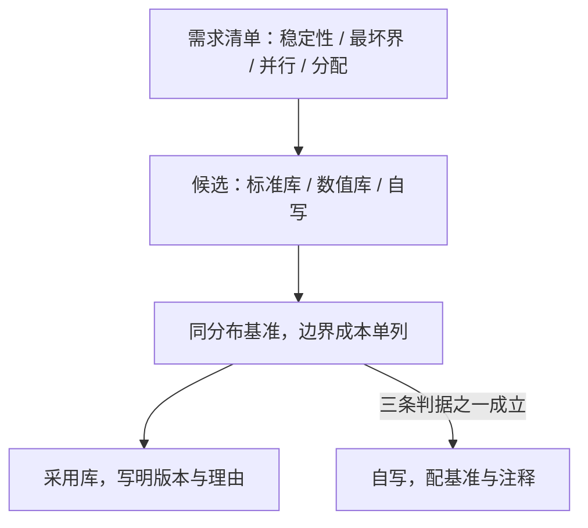

# 算法库的对照与使用

标准库是前人选型的化石：每个排序名字的背后，都是一次对常数、稳定性与最坏情况的表决。

<footer>—— 据 Musser, 1997；Peters, 2002；Lawson et al., 1979 整理</footer>

[上一课](/cs/ae-benchmark-method)给了测量纪律，本课把它对准身边最大的选型现场：算法库。第一课说过「库是默认答案」，这句话只对一半——你得知道库替你做了什么决定、承诺到哪里、什么时候不再合适。本课拆三份样本（排序、高精度、BLAS），再给替换与自写的判据。

## 问题

用库不等于免选型。同一门语言里，`std::sort` 不稳定而 `std::stable_sort` 稳定；数值库分 BLAS 一、二、三级，级别用错，性能差出一个 roofline 层数。缺口是把「库给什么」与「我要什么」摆上同一张表。不这么做会错在三处：拿不稳定排序当稳定排序用，等键的顺序随实现漂移；在接口边界塞进昂贵的比较器与回调，收益全耗在边界上；看见「库慢」就自写全套，却不先查是不是自己用错了接口。

## 方法

第一步，读出库替你做的决定。C++ 的 `std::sort` 是 introsort：快排打底，递归深度超过 $2\log n$ 切换堆排序保最坏界，小区间切插入排序；Python 与 Java 的排序是 Timsort：检测自然有序段再归并，galloping 模式用指数步长吞并整段。每个决定都对应回本课程的一课——最坏界是选型，小区间是常数，自然段是分布红利。高精度算术库（GMP 一族）则按操作数规模在算法间切换，与[高精度算术](/cs/bignum-arith)主干课的谱系对表。

第二步，列保证清单再挑实现：稳定性、最坏复杂度、异常与错误语义、并行版本、内存分配行为；需求先成清单，候选逐项对表。

第三步，用上一课的协议对候选跑同分布基准；接口边界的成本单列——比较器被调用的次数、跨语言或跨分配器的拷贝，都记在边界头上而不是算法头上。

第四步，替换或自写的判据：库里没有你要的分布假设（如定长键上的基数排序）、接口边界吃掉收益、或硬件特殊到库未覆盖——满足其一才动手。

## 机制

introsort 为什么成立：三段各管一段——快排给平均速度，深度触发器给最坏界，插入排序给小区间常数；它是选型四问在一次函数调用里的全部兑现。Timsort 为什么在真实数据上赢：run 检测把既有有序性变成近乎线性的段，对应自适应排序的 $O(n\log r)$ 机制——真实数据几乎从不是随机排列。BLAS 为什么分级：三级矩阵-矩阵运算把访存从逐次读取改成块内复用，算术强度上升、工作点沿屋顶图右移，正是[roofline 的深化与收束](/cs/par-roofline-map)在库设计层面的直接应用。还有一把反向锁：ABI 冻结。稳定二进制接口里，实现所用的算法几乎不能更换，库的「性格」因此长期保守——升级语言版本常常换不来排序算法的换代。

阈值不是玄学：libstdc++ 切插入排序的 _S_threshold = 16，pdqsort 取 24，都是基准扫描出的切换点。读库源码就是读前人的基准结论；源码里每个魔数背后都该有一张扫描图。

## 边界

库的性能随平台与版本漂移，比较结论必须带版本号。不要为最后一倍性能重写数值内核：BLAS 的优化压在汇编与缓存层面，代价是放弃可移植性，除非有新硬件的理由。许可证与维护活跃度计入选型——第一课第四问在库这里的延伸。最后，库不是正确性的终点：主流排序库也被发现过真 bug，收束课以此作结。

## 小结

- 库替你做了决定：introsort 三段各管平均、最坏、小区间；Timsort 吃真实数据的自然有序段。
- 保证清单先于选库：稳定性、最坏复杂度、错误语义、并行版本、分配行为。
- 接口边界是隐形常数：比较器、回调与跨分配器拷贝会吃掉算法优势。
- 自写判据三条：分布假设缺失、边界吃掉收益、硬件特殊；不满足就用库并写明版本。
- 出处：Musser, 1997（introsort）；Peters, 2002（Timsort）；Lawson et al., 1979（BLAS）。
