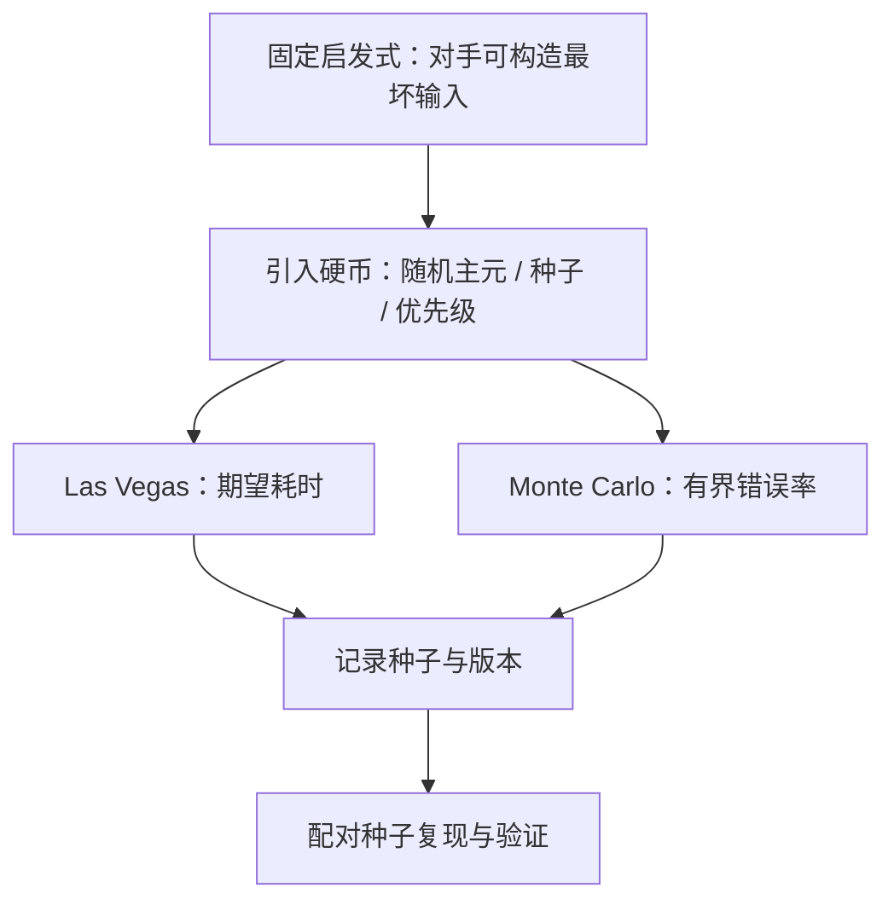

# 随机化算法的实践

随机化把最坏情况从输入手里买回来：对手从此挑不了你的数组，只能挑你的硬币。

<footer>—— 据 Motwani and Raghavan, Randomized Algorithms, 1995 整理</footer>

[上一课](/cs/ae-bit-tricks)把字内并行收拢后，本课转向第三类工程杠杆：掷硬币。主干课的[快排与期望](/cs/quicksort-expected)推过随机主元的 $O(n\log n)$ 期望界，[Pollard rho](/cs/pollard-rho) 用随机游走找因子；本课把它们当同一件工程工具收拢成三问：掷什么、怎么掷、怎么守。

## 问题

固定启发式最怕对手。固定取首元素为主元的快排，遇上构造好的输入退化为 $\Theta(n^2)$；固定哈希函数加上公开的键，攻击者能批量造出同桶键——2011 年前后多个 Web 框架因此被哈希碰撞攻击拖垮，纷纷引入随机化种子。缺口是把最坏情况的控制权从输入手里拿回来。不这么做会错在三处：`rand() % n` 的模偏置让靠前的元素被抽中得多一点，采样分析全歪；用时间戳做种子，同一秒启动的进程拿到同一序列，等于没掷；把 Monte Carlo 的近似答案当精确值上报，误差没人兜底。

## 方法

掷什么：排序类用随机主元与 Fisher–Yates 洗牌（从后往前，每个剩余位置等概率交换）打底；哈希表用种子化哈希，把碰撞从「对手可构造」变成「期望事件」；平衡结构用 [Treap](/cs/treap)——按随机优先级旋转，无需手调平衡因子——与[跳表](/cs/skip-list)；内存换精度用[布隆过滤器](/cs/bloom-filter)。

怎么掷：均匀区间要用拒绝采样，或只在整除关系成立时取模，否则偏置；种子取自高熵源，并且**记下来**——种子是实验参数，不是废弃物。

怎么守：Las Vegas（永不错、只随机耗时，如随机化快排）与 Monte Carlo（可能错、错率有界，如布隆过滤器）分开标记，接口与文档注明各自动词。验证走配对：同一组种子跑新旧两版实现，方差立刻小一圈，配对的意义在基准一课展开。

## 机制

随机化为什么赢在对手模型：期望界是对硬币分布取的，不假设输入分布——对手必须先于你的硬币做决定，于是「最坏输入」不存在，只剩「最坏运气」，而运气可控。这正是[对手论证](/cs/adversary-argument)那套下界技巧的反面用法：既然比较下界盯得住确定性算法，随机化就换一个被平均的对象。两档保证各有账目：期望界由 Markov 一族不等式升级为高概率界；近似结构的误差由公式给出，不是拍脑袋。随机化通常还附带实现红利：随机主元的快排比手调三数取中简单，Treap 比红黑树少一半分支，省下的复杂度本身就是常数。

布隆过滤器的账：每键 $m/n=8$ 比特、$k=6$ 个哈希（接近最优）时误报率约 2.2%；压到 0.1% 要 $m/n\approx 15$。随机化的代价要显式记账，它才不会被当成免费的魔法。

## 边界

密码学场景的随机源是另一门课：普通 PRNG 的输出可预测，种子一旦可推断，本课的一切保证作废。可复现性要求种子随实验归档——不能复现的随机结果既无法 debug，也进不了回归测试。随机化不豁免正确性测试：期望界不担保任何单次运行，空输入、全同元素这类边界仍要用确定性用例钉住。本课只到「期望与高概率」为止；近似算法的误差-时间谱系与计数估计，是近似课程的主题。

## 小结

- 随机化把最坏输入换成最坏运气：期望界或高概率界，对手先于硬币行动。
- 常用五件：随机主元与 Fisher–Yates、种子化哈希、Treap、跳表、布隆过滤器。
- 随机源是正确性的一部分：拒绝采样防模偏置，高熵种子，用后归档。
- Las Vegas 与 Monte Carlo 分开标记，误差与耗时谁在掷硬币要写清楚。
- 出处：Motwani and Raghavan, *Randomized Algorithms*, 1995；Mitzenmacher and Upfal, *Probability and Computing*, 2005；Bloom, 1970。
