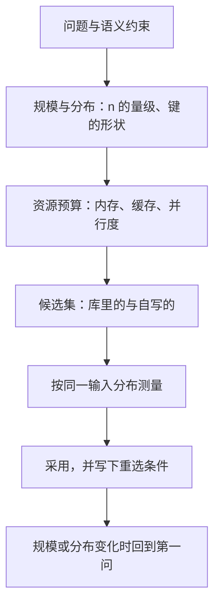

# 算法选型的工程视角

渐近记号回答「最终谁赢」，工程选型回答「在这台机器、这批数据、这个交付日期下谁赢」；两个问题都值得问，但只有后者会被部署。

<footer>—— 据 Knuth, Structured Programming with go to Statements, 1974；Bentley, Writing Efficient Programs, 1982 整理</footer>

[上一课](/cs/pe3-map)给「性能工程案例」收束：定需求、搭测量、查回归、算容量、追长尾、对成本七课拼成一个周期，三条骨架跨场景成立——一切主张带判据、测量的是三元组、预算同构，Amdahl 封收益上限、Little 配在途资源。性能的纪律在前收束；更早，主干课把「图、代数与近似算法」收在 [word RAM](/cs/word-ram) 上：一旦承认机器字有 $w$ 比特宽，比较模型的下界就被字级并行撬动。这个收束正是本课程的入口——主干课给了渐近记号、模型与证明，本课程「算法工程实践」把镜头掉转：在真实的规模、分布、硬件与交付约束下，算法如何被选中、调快、验证与交付。本课是第一课，先立一个全课共用的四问框架；后面七课都默认你已经读完本课。

## 问题

教科书按渐近阶给答案，但渐近陈述只对 $n\to\infty$ 成立，而常数、输入分布、内存预算与现成实现在有限规模上共同决定赢家。缺口不是再学一个更优的算法，而是一套把约束摆上桌的选型流程。不这么做会错在两头：在 $n=10^3$ 的小表上搬出渐近最优的斐波那契堆，维护了指针与摊还边界，却输给一个数组的线性扫描；反过来，在 $10^9$ 规模上沿用为小区间调好的插入排序，常数再省也追不上阶的差距。第三类错误更隐蔽：分布搞错——几乎有序的真实数据上，自适应排序远胜「渐近更优」的非自适应实现，题目其实换了。

## 方法

选型四问，按序回答：

第一问，**规模与分布**。$n$ 的量级决定渐近是否已经压倒常数；两条实现的时间曲线 $c_1 f(n)$ 与 $c_2 g(n)$ 的交叉点由 $c_1 f(n)=c_2 g(n)$ 解出，交叉点之前选简单的那个。键的分布决定算法族：比较排序、基数排序、哈希与搜索树在不同分布下换位。

第二问，**资源预算**。内存上限、缓存大小、可并行度；同一算法在内存与外存里是两道题，在 L2 与 DRAM 屋顶下也是两个点。

第三问，**现成实现**。标准库与成熟库里有没有、接口能不能套上（比较器、分配器、错误语义）。自写是显式决定：维护与出错成本计入选型。

第四问，**变化方向**。规模会不会涨一个量级、分布会不会漂、会不会换硬件；为今天的 $n$ 选交叉点之下的简单算法时，留一条量级涨了就换的退路。

## 机制

为什么渐近终究获胜：常数是乘性的，两条曲线之比 $\dfrac{c_2 g(n)}{c_1 f(n)}$ 在阶差存在时随 $n$ 发散，但发散可以很慢。取 $f(n)=n\log n$、$g(n)=n^2$、$c_2/c_1=1000$，交叉点在 $n/\log_2 n=1000$ 附近，即 $n$ 约两万；也就是说，一万多条记录以内，「平方」实现完全可能赢，阈值要靠测，不靠感觉。

为什么分布能换掉答案：几乎有序输入上的自适应排序，比较次数降到 $O(n\log r)$（$r$ 为乱序程度），直接砍到接近线性。数据库优化器是把选型制度化的最大现场：join 不写死一种算法，而是按统计信息在候选间挑，[排序归并连接](/cs/sort-merge-join)只是其中被挑中的一支。为什么维护算进机制：库函数一行、有测试与文档，自写结构省下的每毫秒都要乘上未来改动的风险——这正是 Knuth「过早优化是万恶之源」在选型层面的含义。

交叉点被主流实现写进了代码：libstdc++ 的 std::sort 在子区间低于阈值 _S_threshold = 16 时切插入排序，pdqsort 取 24。教科书里「渐近更优」的选择，在工程里被一个两位数的小区间常数否决。

## 边界

本课只立框架，不落入单点优化：压常数、缓存布局、字内并行分属接下来三课。渐近记号本身的定义与性质见[渐近记号](/cs/asymptotic-notation)，本课不再推。选型结论有保质期：规模涨一个量级、分布漂移、硬件换代，任一触发都回到第一问；「怎么测才作数」是基准一课的纪律。并行与外存各有专课，本课程不重讲。

## 小结

- 选型四问按序回答：规模与分布、资源预算、现成实现、变化方向；渐近只在第四问之后登场。
- 交叉点之前常数说了算：$c_2/c_1=1000$ 时 $n\log n$ 与 $n^2$ 的交叉点在一两万条记录量级。
- 分布改变题目：自适应实现在真实数据上常击败「渐近更优」的选择，join 由优化器按统计选。
- 库是默认答案，自写是显式决定；维护与错误成本计入选型。
- 选型结论有保质期：规模、分布、硬件变化即重选，判定靠基准课的测量纪律。
- 出处：Knuth, *Structured Programming with go to Statements*, 1974；Bentley, *Writing Efficient Programs*, 1982；据本课四问口径整理。
