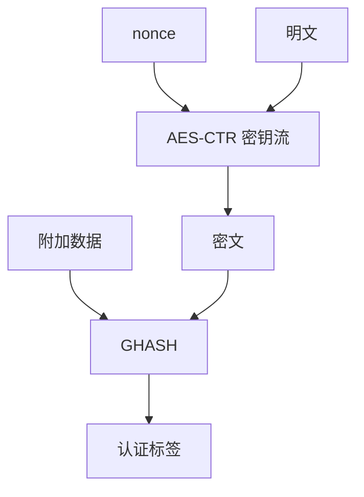

# AEAD 与 GCM 内部

AEAD 一次调用同时给出保密与完整性。GCM 用 CTR 加密，用有限域上的 GHASH 吃密文与附加数据；标签错了就该丢整条消息。

<footer>—— McGrew and Viega, The Galois/Counter Mode；NIST SP 800-38D</footer>

## 定位

上一课[ChaCha20](/cs/chacha20)给出软件密钥流。主干[分组模式](/cs/block-modes)已把 GCM 当 AEAD 名字。缺口是**内部**：CTR 与 GHASH 如何咬合，附加数据（AAD）为何不加密却进标签。[MAC 与签名](/cs/mac-signature)的 Encrypt-then-MAC 在此收成单一原语。

后课默认已经读完本课钉下的合同，只补差，不从该领域第一性原理重开。

## 问题

只加密的 CBC 留下主动篡改。GCM：密钥流来自 AES-CTR（或等价），认证来自 $ \mathrm{GF}(2^{128}) $ 上的多项式求值 GHASH，最后再加密得到标签。AAD 让头部明文仍被认证。缺口是理解「一次 nonce、一块标签」的合同，不是再背套件名。

### 标签失败即拒绝

解密先验标签；失败则不释放明文。把失败当「再试试填充」会重开预言机——下一课。

SP 800-38D 限制同一密钥下 nonce 不得重复。96 比特 nonce 最常见。GHASH 不是抗碰撞哈希；它是带密钥的通用哈希，安全靠密钥保密与 nonce 唯一。

## 方法

画：J0 从 nonce 来，CTR 加密块，GHASH 扫 AAD 与密文，再与 E(K,J0) 混合成标签。对照 ChaCha20-Poly1305：同一 AEAD 形状，多项式不同。指出 TLS 1.3 只保留 AEAD。

图中节点是本课的机制骨架；课程不把图展开成可运行的攻击步骤。

## 机制

AEAD 把[CIA](/cs/cia-triad)的 C 与 I 绑到同一密钥与同一 nonce。主动改密文或 AAD 会使标签失败。它仍假设密钥未泄漏、实现常数时间、nonce 不重复。公钥与身份不在本课。

前提写进合同之后，游戏外的误用只当失败模式点名，不在本课写成操作程序。

## 边界

本课不写 GHASH 的全部域算术作业，不给 nonce 复用下的密钥恢复步骤。下一课专收 **nonce 误用与重放**：合同一旦破，GCM 的证明作废。

## 小结

- 流密码与分组密码都要 AEAD 包装。
- GCM：CTR 保密，GHASH 认证，AAD 进标签。
- 标签失败则丢消息；不要当填充预言。
- nonce 唯一是下一课的主缺口。
- 出处：McGrew and Viega；NIST SP 800-38D；RFC 5116 AEAD 接口。
