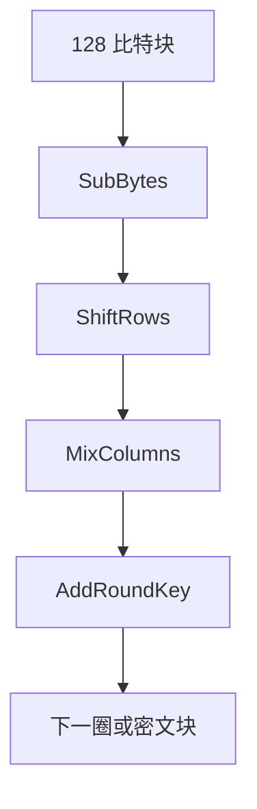

# AES 结构

AES 是 128 比特块上的代换–置换网络：字节代换、行移位、列混合、加轮密钥。它是候选伪随机置换，不是一次一密，也不是「公开算法就不安全」。

<footer>—— Daemen and Rijmen, The Design of Rijndael；NIST FIPS 197</footer>

## 定位

上一课[PRG 与 PRF](/cs/prg-prf)给出计算安全的函数合同。缺口是**实践里那张置换表从哪来**。主干[对称加密](/cs/symmetric-crypto)已用 AES 当名字；本课只补结构：SPN、圈数与密钥宽，不把侧信道当本课主轴。

后课默认已经读完本课钉下的合同，只补差，不从该领域第一性原理重开。

## 问题

PRF 课留下「候选」。Rijndael 被定为 AES：状态 4×4 字节，SubBytes 用有限域逆，ShiftRows 扩散位置，MixColumns 在 $ \mathrm{GF}(2^8) $ 上混列，AddRoundKey 异或轮密钥。缺口是理解为何这是 SPN 而不是 Feistel——后课才对照 DES。不要把圈数口算成「安全比特」。

### 公开算法

Kerckhoffs：敌手知道算法。安全性在密钥。把 AES 当「军用机密算法」是倒退。

FIPS 197。宽 128/192/256 只改圈数与密钥扩展，块仍是 128。本课不写差分/线性分析的操作程序，只承认设计对着这些分析留余量。

## 方法

按一圈的四步走一遍数据路径。密钥扩展把主密钥变成轮密钥。强调：AES 本身只处理一块；消息长度、完整性、nonce 是[分组模式](/cs/block-modes)的合同，本课不重写 GCM。

图中节点是本课的机制骨架；课程不把图展开成可运行的攻击步骤。

## 机制

代换提供非线性，置换与列混合提供扩散，轮密钥打断对称。作为 PRP 候选，它被模式调用：ECB 仍会泄漏相等块——那是模式的锅，不是圈函数「弱了」。实现必须防缓存定时，那是侧信道课的缺口，结构课只点名。

前提写进合同之后，游戏外的误用只当失败模式点名，不在本课写成操作程序。

## 边界

本课不讲如何差分分析，不列全部 S 盒代数式当作业。下一课用 Feistel 对照：DES 把块劈成两半，AES 则是 SPN。后课默认：提到分组密码结构，AES 指 FIPS 197 的 SPN。

## 小结

- PRG/PRF 要候选；AES 是 128 比特 SPN。
- 圈函数：代换、移位、列混、加轮密钥。
- 块密码≠模式；完整性仍在 AEAD。
- Feistel/DES 是下一课的结构对照。
- 出处：Daemen and Rijmen, *The Design of Rijndael*；NIST FIPS 197。
