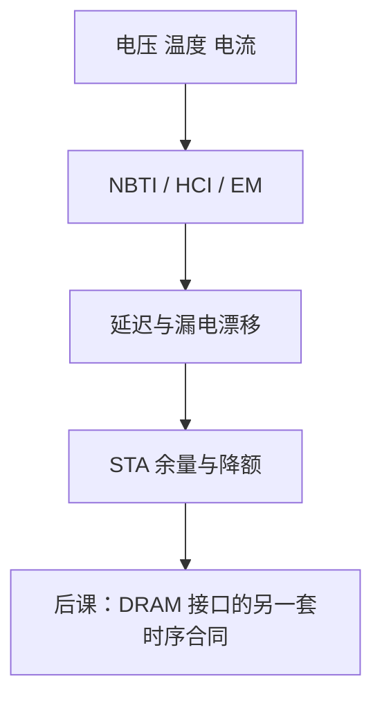

# 老化与可靠性

  
NBTI、热载流子、电迁移让阈值漂、连线变脆：昨天 STA 过的路径，几年后在高温高电压下可能建立失败，这不是一次粒子事件。

  <footer>—— 据 Weste and Harris, CMOS VLSI Design；JEDEC 可靠性应力标准实践；Hennessy and Patterson, CA:AQA 整理</footer>

[上一课](/cs/soft-error-ecc)处理随机瞬时翻转。DFT/BIST 处理出厂缺陷。[功耗](/cs/power-dynamic-static)带来热。缺口是**时间尺度上的漂移**：老化让延迟和漏电变，可靠性要在签核时留边，而不是只信零时刻库。

## 问题

NBTI/PBTI：偏置温度下阈值升高，PMOS/NMOS 变慢。HCI：热载流子损伤沟道。TDDB：栅氧击穿。电迁移：大电流金属孔洞。EM 与电流密度、温度有关，宽算术总线和时钟树是热点。缺口不是再设计 ECC，而是：STA 要用老化后的延迟库或余量，电流密度检查在物理签核里。

与 Dennard 墙相关：更高的功耗密度加速热老化。DVFS 降 $V$ 可减缓部分机制，又与性能折中。

### 老化不是软错误

软错误可纠正且器件仍好。老化是参数永久（或准永久，有恢复）漂移。把 FIT 粒子率当成 MTTF 老化，维修策略会错：ECC 救不了整条时钟树变慢。

Weste/Harris 讨论可靠性机制。JEDEC 有高温工作寿命等应力试验方法（本课不背编号清单）。CA:AQA 把可用性作为系统指标。本课不编造某工艺的寿命小时数。

## 方法

签核：电压温度老化角、电迁移规则、余量。设计：宽金属、冗余过孔、降低热点电流、自适应电压（相对 DVFS 更慢的补偿环）。现场：温度传感器、降频保活，与 BIST 定期自检互补。SRAM 稳定性随老化变差，最低电压要留裕量。

HDL 课序到此封口：从 Verilog 到网表、时序、时钟、复位、CDC、FPGA/ASIC、功耗、经济、验证、测试、软错误与老化。下一单元内存与 I/O 把这些块接到 JEDEC 与 PCIe 的真实协议。

## 机制

DRAM 刷新本身也是对抗漏电的可靠性机制，但规格在 JEDEC，不在 CMOS 老化公式里。PCIe SERDES 有自己的眼图老化。本课只钉数字 CMOS 参数漂移，让后课接口规范的时序是「寿命期内仍要满足」。

## 边界

本课不推导反应–扩散 NBTI 方程，不写封装焊点疲劳的力学。不进入光刻胶老化。不把金融「可靠性」隐喻写进来。

后课默认：时序签核含老化余量；软错误与老化分机制；数字系统实现课序结束，改接 DRAM 组织。

## 小结

- 老化是延迟/漏电/连线的缓慢损伤，不是 SEU。
- 签核用余量与电流密度规则；现场可降额。
- HDL 实现单元收束，下一课通道/rank/bank。
- 出处：Weste and Harris；JEDEC 应力实践；Hennessy and Patterson, CA:AQA。
