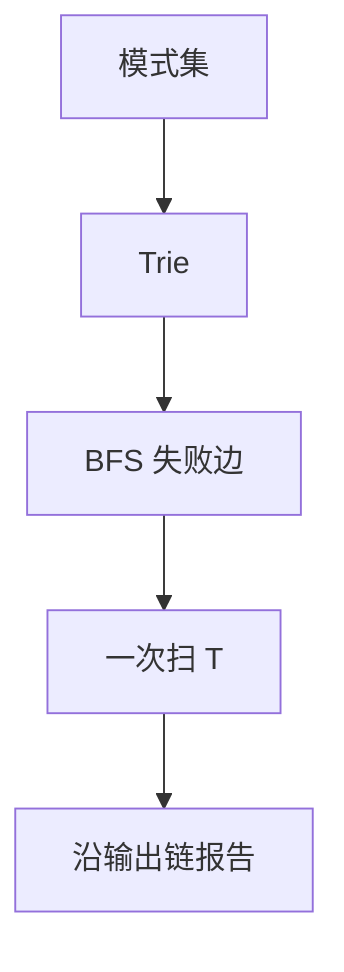

# Aho–Corasick

多模式先建成一棵带失败边的 trie；扫文本一次，沿转移与失败链输出所有命中。

<footer>—— 据 Aho and Corasick, Efficient String Matching: An Aid to Bibliographic Search, 1975；CLRS 第 32 章整理</footer>

上一课[Boyer–Moore](/cs/boyer-moore)优化单模式跳读。$k$ 个模式各跑一遍，总代价随 $k$ 倍增，且共享前缀被重复比。本课不重做坏字符表。缺口是**一机多模式**：把 $P_1,\ldots,P_k$ 做成自动机，扫 $T$ 线性于 $n$ 加命中次数。后课离开串，进入贪心范式。

## 问题

[Trie](/cs/trie) 已能插入多个串。匹配时失配不能只退回根：当前节点代表的前缀的真后缀可能是另一模式的前缀。Aho–Corasick：每个节点一条失败边，指向「最长真后缀」对应的节点（KMP 的 $\pi$ 在树上的推广）。扫描：$T$ 的下一字符有转移则走，否则跟失败边直到有或到根。节点若标记模式结束（或失败链上有结束），报告命中。

缺口是失败函数，不是再写 $k$ 次 KMP。预处理对模式总长 $m$ 线性（字母表当常数或用 map 则多对数）。扫描 $O(n+z)$，$z$ 为输出个数。

### 失败边不是父指针

父指针回退会丢掉「后缀也是前缀」。失败边可能跳到另一分支。输出链：沿失败边收集所有结束标记，避免漏掉被当前前缀包含的短模式。

Aho–Corasick 1975，CACM。与 KMP 同一自匹配思想，对象从串换成 trie。后课词法的「多种记号」是正则并，不是本课的精确多模式词典。

## 方法

将模式插入 trie，根的失败为根。BFS 按层算失败：孩子 $c$ 的失败 = 父失败沿 $c$ 能走到的节点。再扫 $T$。

二进制字母表或 Unicode 的转移表要权衡空间；本课渐近把 $|\Sigma|$ 当实现参数。

## 机制

摊还：失败边使状态上的「当前匹配长度」不增得太快，与 KMP 的 $q$ 同类。不要对每个位置把失败链走到底而不记账——输出链应预处理成直接链表。重叠命中（`aa` 在 `aaa`）必须都报，除非题目去重。

与 BM：多模式上 BM 没有这份自动机；词典检索用本课。

## 边界

本课不做正则、不写近似、不处理通配符。失败函数假定精确字符相等。后课默认：多模式精确匹配一次扫描；贪心作为设计法的正确性从下一课单独论证，不再扫串。

## 小结

- 多模式 = trie + 失败边（KMP 在树上）。
- 预处理线性于模式总长；扫描线性于文本加输出。
- 精确词典，不是正则词法。
- 出处：Aho and Corasick, 1975；CLRS 第 32 章。
