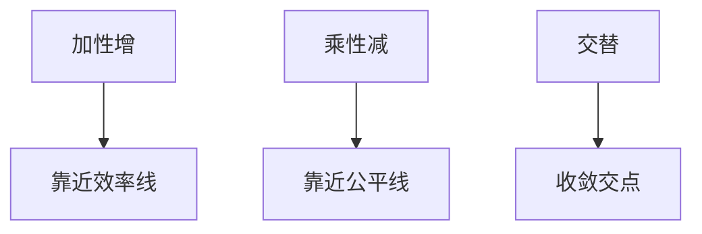

# AIMD 与 Chiu–Jain

加性增、乘性减使共享瓶颈的流在公平与效率之间收敛；Chiu–Jain 用二维相位图说明为何 MIMD 会漂。

<footer>—— 据 Chiu and Jain, Analysis of the Increase and Decrease Algorithms, Computer Networks 1989；Jacobson, 1988 整理</footer>

主干[拥塞控制](/cs/tcp-congestion) 已用 AIMD。[上一课](/cs/roce-lossless) 结束转发面。缺口是**为什么是 AI 而不是 MI**：两用户相位图、公平线与效率线。本课不把快重传状态机写完。

## 问题

两流共享容量 $C$。效率线 $x_1+x_2=C$，公平线 $x_1=x_2$。加性增：平行于公平线走向效率；乘性减：沿过原点射线退回。MIMD 增沿射线走，到不了公平。AIAD 在效率线附近振荡不收敛。数据中心 DCTCP 仍是乘性，只是减得更温和。广域卫星 BDP 大使 AIMD 探到 $C$ 的时间变长，不改几何。

不要把 Jain 公平指数写成必须每课计算，这里只要相位图直觉。

Chiu–Jain 1989。同步假设理想化；延迟 ACK、不同 RTT 后课会破公平。本课钉同 RTT 同步。

### 同 RTT 才有那张相位图

AI 走向效率，MD 走向公平。MIMD 漂。不同 RTT 与 ACK 压缩会偏离交点，后课再破。

## 方法

画相位图：效率、公平、AIMD 轨迹。对照 PFC：链路暂停不是 AIMD，无公平定理。对照 WFQ：调度器显式公平，AIMD 是端到端隐式。

方法止于选定对象与对照；机制才说它如何嵌入已有分层与主干课。

## 机制

Reno 每 RTT 约加一 MSS，丢则减半，是 AIMD 实例。CUBIC 用时间立方，仍有乘性事件。ECN 把「减」从丢包提前，几何类似。多瓶颈与不同 RTT 使交点偏离，后课 RTT 不公平。

与交换机 VOQ 匹配对照：一个在端，一个在跳；都在分配 $C$。

## 边界

本课不证一般 $n$ 流的全部 Lyapunov。快速重传与恢复是下一课。后课默认：同 RTT 下 AIMD 收敛到公平有效；其它增减组合不。

实际 ACK 压缩会让「每 RTT 加一」变成突发，几何仍近似。

上一课留下的缺口在本课收口；「AIMD 与 Chiu–Jain」进入后课词汇表后只引用。文献用来钉对象与边界，不把本课写成该主题的独立综述。下一课[快速重传与恢复](/cs/fast-retransmit-recovery)。

## 小结

- AIMD 在效率–公平图上收敛。
- MIMD/AIAD 不提供同样保证。
- TCP 减半是 MD；DCTCP 是更小的 MD。
- 后课只引用本课钉死的对象，不从该领域总问题重开。
- 出处：Chiu–Jain, 1989；Jacobson, 1988。
