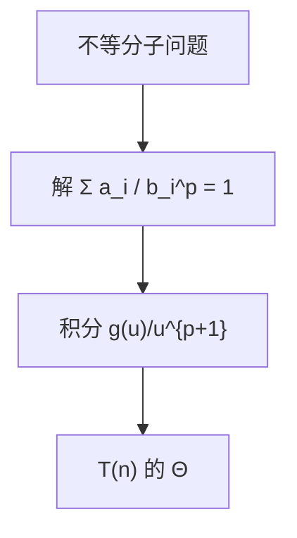

# Akra–Bazzi 对照

子问题不必等分：只要切法渐近稳定，解仍由一项积分与临界幂 $n^p$ 决定。

<footer>—— 据 Akra and Bazzi, On the solution of linear recurrence equations, 1998；CLRS 第 4 章对主定理的讨论整理</footer>

上一课[主定理](/cs/master-theorem)只收 $T(n)=aT(n/b)+f(n)$。三种情形已经能读归并与二分，但切块大小可以不同：$T(n)=T(\lfloor n/3\rfloor)+T(\lceil 2n/3\rceil)+\Theta(n)$ 没有单一的 $b$。本课不重证几何级数。缺口是一条对照公式，让后课分治在不等分时仍有阶，而不把每一道递归树重画成百科。

## 问题

主定理的 $a$ 个子问题一律 $n/b$。实际切法常一边三分之一、一边三分之二，或再加一项 $T(n/4)$。叶子不再是整齐的 $n^{\log_b a}$。缺口不是再发明大 $O$，而是承认：若 $T(n)=g(n)+\sum_{i=1}^k a_i T(n/b_i)$（地板可忽略），存在唯一 $p$ 使 $\sum a_i b_i^{-p}=1$，则

$$T(n)=\Theta\Bigl(n^p\Bigl(1+\int_1^n \frac{g(u)}{u^{p+1}}\,du\Bigr)\Bigr).$$

$g$ 多项式地小于、等于、大于 $n^p$ 时，积分给出与主定理三种情形同类的主导项。规律性条件仍要：$g$ 在多项式因子内不太振荡。

### 对照不是第三套渐近记号

$p$ 就是不等分版的 $\log_b a$。等分时 $k=1$、$a_1=a$、$b_1=b$，方程 $a b^{-p}=1$ 解出 $p=\log_b a$，积分退化成主定理。本课不换 $O$、$\Theta$ 的定义，只换临界指数的算法。

Akra–Bazzi 1998 处理线性递推的连续近似。CLRS 把主定理当特例，把地板、$\pm 1$ 丢进光滑性。后课只引用「先解 $p$，再看积分」，不把证明展开。

## 方法

写出各 $a_i,b_i$ 与合并项 $g$。数值或对数求解 $p$。比较 $g(n)$ 与 $n^p$：积分收敛则 $T=\Theta(n^p)$；对数发散则多 $\log$；根上的 $g$ 更大则 $T=\Theta(g)$。替换法仍可验证猜出的阶。

主定理能套时不必走积分。本课是它失效时的出口，不是默认第一步。

## 机制

有了 $p$，后课写「一半再一半」或「三分之一加三分之二」都可以落成同一句话：临界幂由切法的加权平均决定。正确性仍走递归归纳，本课只管代价。也不要把 $p$ 当成输入规模；它由算法的切法钉死。

减而治之 $T(n)=T(n-1)+\Theta(n)$ 没有 $n/b_i$ 形式，积分公式不适用，仍是等差求和。期望递归（随机切点）也不是本课对象。

## 边界

本课不证积分公式，不处理 $g$ 在临界附近振荡的病态。也不把分治当作设计法讲完：切什么、合什么，下一课才命名。后课默认：等分先主定理；不等分先 Akra–Bazzi 的 $p$。

后课默认：谈到分治递归，阶可以读。分治三步本身是下一缺口。

## 小结

- 不等分递推用 $p$ 满足 $\sum a_i b_i^{-p}=1$，再看 $g$ 的积分。
- 等分时退回主定理；减一与期望递归不在本课。
- 本课只给阶，不给分解–合并的正确性模板。
- 出处：Akra and Bazzi, 1998；CLRS 第 4 章。
