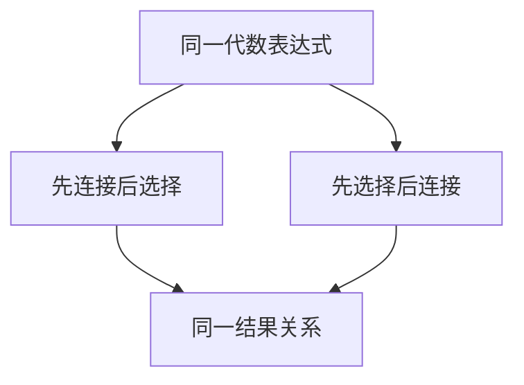

# 选择投影连接的顺序

同一表达式可以先选后连或先连后选；等价变换不改结果关系，只改中间结果有多大。

<footer>—— 据 Codd 1972 代数；Ullman 对代数等价；Ramakrishnan and Gehrke</footer>

[上一课](/cs/relational-algebra)给出选择、投影、连接等闭运算。本课不重推五种基本运算。缺口是：代数树的形状。先把两个大关系连接再选择，与先选择再连接，若谓词只涉及一侧，结果相同，页 I/O 差几个数量级。后课 SQL 优化器吃的就是这些律。

## 问题

代数是指称，不是执行计划。但课序马上要进声明语言与物理算子，必须先承认：**连接结合律、选择下推、投影可穿连接**（在无副作用、集合语义下）。缺口不是代价数字，而是「合法重排」这一层。NULL 与包语义会打破部分律，后课再钉。

选择下推：σ 可以穿过一侧无该属性的连接，落到含该属性的叶子。投影要保留连接键，否则不能穿。

## 方法

写同一查询的两棵树：σ–⋈ 与 ⋈–σ。用集合恒等说明它们相等。结合律让三点连接改括号。本课不算页数，只要求读者看到中间基数会变。物理算法下一单元才出现。

## 机制

重排把「查询含义」与「操作顺序」分开，这是数据独立性在运算层的投影。后课代价估计给每棵物理树打分；没有本课的等价意识，优化器会被看成随便改用户 SQL。外键约束有时提供额外等价（存在性），本课不展开。

## 边界

本课不引入外连接的全部非等价例子当主干，不把分布式下推到存储引擎的接口写完。如何用英文句子写查询，下一课 SQL 声明性。

后课默认：选择、投影、连接可以按律改序。语言层还没有。

## 小结

- 代数律允许改树而不改结果。
- 中间大小可变，代价是后课的事。
- SQL 下一课。
- 出处：Codd 1972；Ullman；Ramakrishnan and Gehrke。
