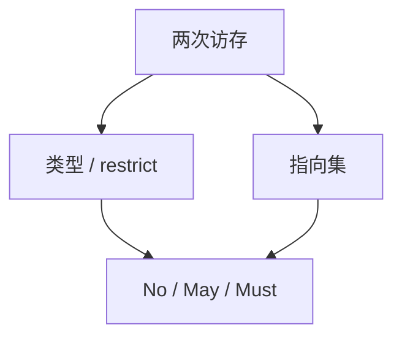

# 别名分析

两次访存是否可能指向同一对象，决定 load 能否外提、store 能否换序。分析必须可靠：把「可能别名」说成「不别名」会改语义。

<footer>—— 据龙书 12.4 指针别名；Muchnick；ISO C `restrict`；Wilson and Lam 对照整理</footer>

上一课[多面体](/cs/polyhedral-model)在仿射下标下精确知道数组单元。缺口是**指针**：C 的 `*p` 与 `*q`。别名分析给出 Must / May / No。主干优化默认保守 May。本课钉分类与语言规则（类型别名、`restrict`），具体 points-to 下一课。

## 问题

LICM、向量化、DCE 对 store 都问：中间有没有对同一地址的写。无分析则任何 store 杀死所有 load 的可用。缺口是**别名查询接口**，不是调度。

C：不同基本类型默认不别名（strict aliasing），`char*` 例外。打破规则是 UB，优化可当不别名——[UB 课](/cs/undefined-behavior-opt)。`restrict` 是程序员承诺。

### May 不是「运行时有时别名」

May 是静态不知道。Must 是必同。查询 API：`alias(p,q) ∈ {No, May, Must}`。优化只用 No 当许可。

龙书指针分析导引。ISO C 别名规则。Fortran 默认不别名数组参数。本课不写 Steensgaard 算法，下一课。

## 方法

基线：按类型、按分配点（栈槽互异、malloc 不重叠除非语言允许）、按 `restrict`。字段敏感：结构体不同字段可不别名。再接到 points-to 图。

与所有权：借用检查在源级已禁某些别名；降到 IR 后分析仍要跑，因 `unsafe` 与 FFI。

## 机制

过程间：callee 是否写 `*p` 要摘要。无摘要则 May 写全局。不要把 Java 的类型精确当 C 的 `char*` 规则。

TBAA（type-based alias analysis）把语言规则编进 IR 元数据；错误的元数据 = 错误优化。

## 边界

本课不实现 Andersen。后课默认：优化问别名，No 才激进。下一课 Andersen / Steensgaard 指向分析。

也不把别名当加密侧信道模型。

## 小结

- 别名查询：No 才允许把两次访存当独立。
- 语言规则（TBAA、restrict）是分析的输入。
- 可靠优先于精确。
- 出处：Aho et al. 龙书；ISO C；Muchnick。
