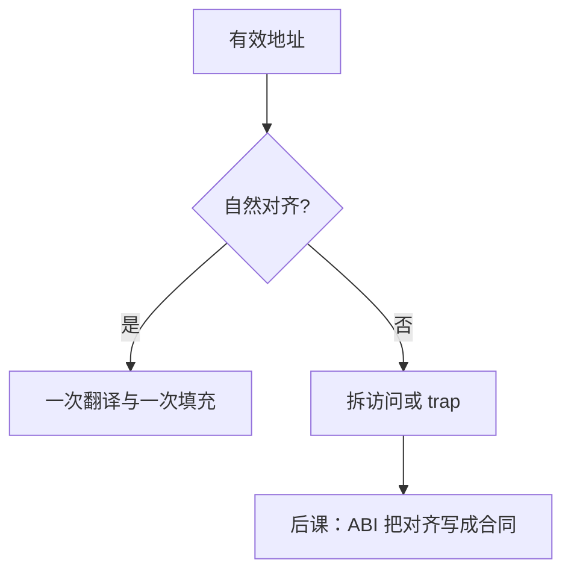

# 对齐与非对齐访问

  
自然对齐让一次访存落在单次总线事务与单次缓存行内；非对齐或被硬件拆成两拍，或 trap 到固件，原子与 SIMD 往往更严。

  <footer>—— 据 The RISC-V Instruction Set Manual；ARM ARM；Intel SDM；Hennessy and Patterson, CA:AQA 整理</footer>

[上一课](/cs/endianness)钉了字节在字内的次序。次序假定「这一次 load 读的就是那四个字节」。缺口是 **对齐**：地址是否为宽度的倍数，以及 ISA 对违规的态度——硬件修复、异常，还是原子直接拒绝。

## 问题

自然对齐：`N` 字节对象要求 `addr ≡ 0 (mod N)`。未对齐时，访问可能跨缓存行甚至跨页：一次逻辑 load 变成两次翻译、两次填充。[压缩指令](/cs/riscv-compressed) 已要求 16 位取指对齐；数据侧同类问题更大，因为 `ld` 是 8 字节。

x86：普通访存允许非对齐，罚的是周期；`EFLAGS.AC` 可打开对齐检查。A64：普通内存上多数 load/store 可非对齐；独占监视器与部分设备内存更严。RISC-V：实现可硬件处理、可 trap 到 M 态模拟，规范不强制同一种性能。缺口不是端序，而是**这条路径在手册里是否合法、是否原子**。

[LR/SC 与 CAS](/cs/lr-sc-cas) 通常要求自然对齐，否则保留集与缓存行排他没有定义。SSE 的 `movaps` 要求 16 字节；`movups` 才放松——[SIMD](/cs/simd-extensions) 把对齐写进助记符。

### 对齐不是「编译器多插几个 nop」

指令对齐影响取指打包；数据对齐影响 ABI 的 `alignof` 与结构体填充。把两者混成「好看」，栈上 `double` 未按 ABI 对齐时，AAPCS/SysV 直接未定义或罚崩。

RISC-V 非特权手册的 misaligned。ARM ARM 的 Alignment fault。Intel SDM 的 Alignment Check 与非对齐惩罚。CA:AQA 用对齐解释缓存与总线。

## 方法

编译器按 ABI 给标量与结构体填填充字节；packed 结构显式放弃对齐，生成字节拼装或非对齐 load。内核与驱动访问 MMIO 必须用架构允许的宽度与对齐，否则设备与总线协议先坏。跨页非对齐：可能两次缺页，[Sv39](/cs/sv39-page-table) 走访两次。

与 [fence](/cs/fence-instructions)：拆成两次的 store 之间仍受内存模型约束；不能假设设备看见一次原子字写。

## 机制

ISA 对照单元快结束：编码、特权、向量、端序、对齐都是硬件保证的边界。软件还要在这些边界上叠一层**调用约定与目标文件合同**——同一颗核、同一 ISA，SysV 与 Windows x64 仍不能互调。下一课把 ISA 收成 ABI 边界，并交给微结构进阶：前端看到的分支，是编译器按这份合同发出来的。

## 边界

本课不把所有 MMIO 设备的访问宽度表抄来，不保证软模拟非对齐的延迟。不进入数据库列存的对齐 SIMD 作业全文。

后课默认：原子与许多 SIMD 要自然对齐；普通标量在 x86/A64 上常可非对齐但有代价；RISC-V 实现可选 trap。下一课 ISA 作为 ABI 边界。

## 小结

- 自然对齐服务单次缓存行与原子性。
- 非对齐：硬件拆、trap，或指令直接不允许。
- 端序与对齐是两件独立的 ISA 事实。
- 出处：RISC-V ISA；ARM ARM；Intel SDM；Hennessy and Patterson, CA:AQA。
