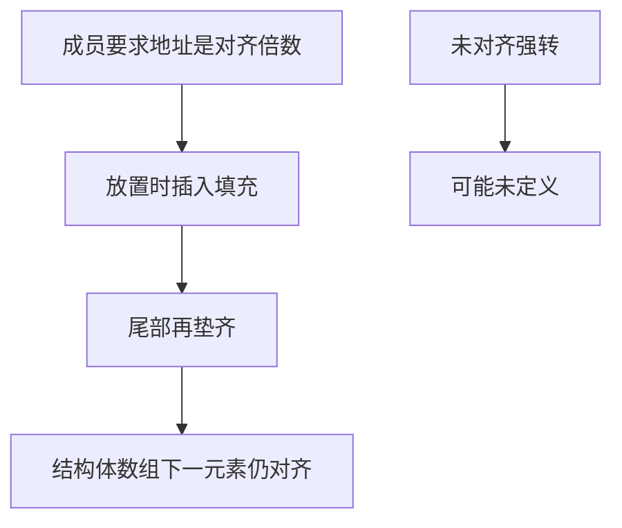

# 对齐与填充

对象的地址必须是其对齐的倍数；结构体为了让每个成员落在合法地址上，在字段之间插入程序员看不见的字节。

<footer>—— 据 ISO/IEC 9899；Bryant and O'Hallaron, Computer Systems: A Programmer's Perspective 整理</footer>

上一课[结构体内存布局](/cs/struct-layout)钉死了按声明顺序的偏移。本课不重讲点号与 `offsetof`，也不从总线协议另起。缺口是：为何两个 `char` 中间会空出三个字节，结构体末尾还要再垫齐——**这些洞从哪条硬件与 ABI 约束来，而不是编译器浪费**。

## 问题

多数机器要求 `n` 字节对象的地址能被 $n$ 整除（或至少被 ABI 规定的对齐整除）。未对齐访问：有的 ISA 会陷入内核再拆合，有的直接异常，有的静默给错数据。缺口因此不是「结构体有洞」的观察，而是**对齐把合法地址变成格点**。编译器在成员之间插入填充，使每个成员的地址满足自己的对齐；结构体自身的对齐取成员对齐的最大者，尾部再垫到该对齐的倍数，以便结构体数组里下一元素仍然对齐。

把填充当成可以随便读写的空闲空间会踩进未指定比特；把结构体当字节流压缩传输而不约定打包规则，会对不齐。本课只解释默认布局下洞为什么在；显式打包属性是实现扩展，主干不依赖。

### 对齐不是「为了好看」

自然对齐让一次访存落在一条缓存行或总线事务里，这是性能动机。语言层面更硬：对某些类型，未对齐的左值访问本身可以是未定义行为。把 `char` 缓冲强转成 `int *` 再解引用，即使你「知道」硬件能读，也已经离开抽象机器。正确做法是 `memcpy` 到对齐的对象，或用字符类型逐字节访问。

CSAPP 用结构体例子展示填充与重排字段如何缩小对象。ISO C 规定实现可以为成员插入填充，并要求 `_Alignof` 反映对齐。本课不把 Cache 行伪共享展开，那是组成课的缺口。

## 方法

每个基本类型有对齐 $a$。结构体对齐 $\geq$ 各成员对齐。放置下一成员时，偏移向上取整到该成员对齐。结束后，结构体大小向上取整到结构体对齐。因此 `sizeof` 可能大于各成员大小之和。字段重排（在 ABI 允许你改源码时）可以把小成员挤在一起，减少洞——但已发布的二进制布局不能为了省洞而改顺序。

`malloc` 返回的空间保证能对齐到任何基本对象；栈上的自动结构体由编译器保证。从文件或网络读来的缓冲区默认只有字节对齐，不能直接当结构体用。

原子与锁变量常要求自然对齐或更大，未对齐的原子访问可以在 ISA 上直接不支持。本课的结构体若把 `char` 放在原子旁，填充会自动垫开；若用打包属性取消填充，原子可能落到非法地址。系统课与并发课再谈原子，这里只把「对齐是合法性」这句话说到字段级。调用约定对栈指针本身也有对齐要求，未对齐的 `sp` 可以使 SIMD 参数或某些 ABI 直接失败，下一课会把对象对齐接到这条栈纪律。

## 机制

填充让「按成员访问」永远落在硬件与 ABI 都接受的地址上，换来的是对象变大、缓存密度下降。这是显式布局语言的税：你看见字段，就必须连洞一起为 ABI 负责。后课调用约定会再碰到对齐：栈槽、寄存器对、向量参数都有自己的对齐规则，本课的结构体对齐是那一套的特例。

字符类型的别名例外允许用 `unsigned char *` 查看对象表示，包括填充。那些字节的值在未初始化时未指定，不可拿来做哈希的稳定输入，除非你先清零整块。

对齐还决定 `malloc` 与栈分配器的最低保证：返回地址必须能放下平台上对齐最严的基本类型。SIMD 与原子对象会要更大的对齐，那时默认堆接口可能不够，需要专门的对齐分配——本课只承认「默认够用到标量与普通结构体」。网络报文与磁盘记录常常按 1 字节对齐打包；把它们 `memcpy` 进自然对齐的结构体，而不是用未对齐指针硬读，是把本课的格点约束留在安全区里。后课调用约定会把同样的格点用到栈槽。

## 边界

本课不讲原子类型的更强对齐，不讲 SIMD 的 16/32 字节要求细节。下一课[调用约定直觉](/cs/calling-convention-preview)把「一块对齐好的对象」送进函数边界。后课默认：对象地址满足对齐；结构体填充为对齐服务；未对齐强转不是可移植技巧。

## 小结

- 对齐要求地址为格点；结构体用填充满足每个成员。
- 结构体大小含尾部填充，以便数组元素仍然对齐。
- 未对齐强转可成 UB；跨边界缓冲应用字节复制。
- 调用约定将在下一课使用这些已对齐的对象。
- 出处：ISO C 对齐；CSAPP 结构体填充与字段重排。
