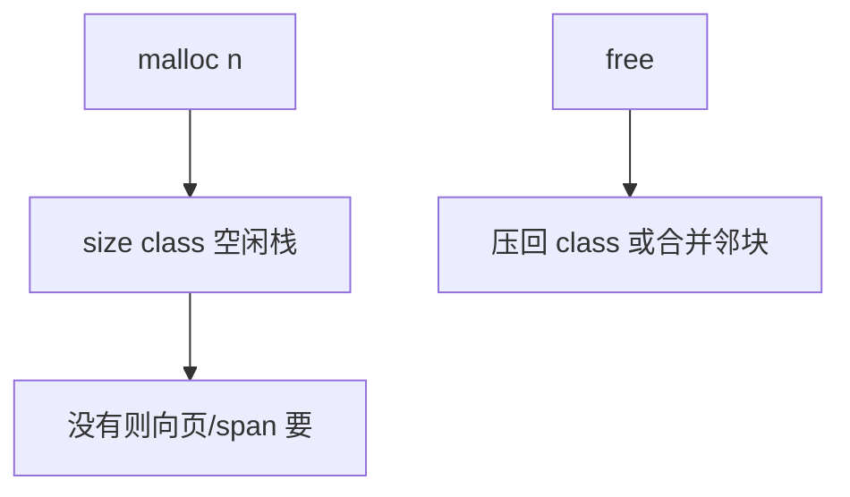

# 分配器内部结构

空闲块用隐式边界标签、显式空闲链、或按 size class 的 slab；分配器是数据结构，不是魔法系统调用。

<footer>—— 据 Knuth, The Art of Computer Programming 卷 1；Wilson, Johnstone, Neely and Boles, Dynamic Storage Allocation: A Survey and Critical Review, IWMM 1995；[buddy 分配器](/cs/buddy-allocator) 整理</footer>

[上一课](/cs/rcu-data-structures) 延迟 `free`，块回到分配器。[buddy](/cs/buddy-allocator) 已给页框。[数组](/cs/array-random-access) 是用户对象布局。本课不 synchronize_rcu。缺口是用户级堆：边界标签、空闲双向链表、分离空闲表、slab/size class。

## 问题

`malloc(n)` / `free(p)` 要 $\Theta(1)$ 或对数找块，减少碎片。隐式：块头存 size 与 busy 位，空闲靠扫描（首次适应）。显式：空闲块内嵌指针成链或树（按大小的 BST/Treap）。分离：每个 size class 一条链，小对象 O(1)。slab：同尺寸对象槽位图或空闲栈。缺口是**把堆管理写成这些结构的组合**，而不是「向 OS 要页」一句。

Knuth 边界标签。Wilson et al. 1995 综述适应策略与碎片。页仍可用 mmap/brk；本课内部。

## 方法

分配：size class 上 pop；没有则向更粗粒度要（buddy 页或新 span）。释放：压回 class，或合并相邻空闲（边界标签看前后块 busy）。线程缓存：每线程 magazine 减锁，耗尽再碰中心堆——并发哈希课的分段思想同构。

与 hazard：延迟释放的块仍占 class，直到真正 free。与 LSM：堆不是日志结构文件，但 thread cache 批量交还类似。

## 机制

元数据放块头则用户越界会毁链——这是安全课边界，本课点名。对齐与 size class 量化造成内碎片。本课不写利用分配器的 exploit。

最后一课：对象图的引用计数遇环不能只靠分配器 free。

## 边界

本课不把 jemalloc/tcmalloc 源码当词条。内核 SLAB 与用户堆同族。GC 标记清除是另一策略，下一课只钉引用计数与环。

后课默认：堆 = size class + 页 span + 可选合并。对象寿命用引用计数时必须处理环。

## 小结

- 分配器：边界标签、空闲链、size class/slab。
- 并发靠线程缓存与分中心堆。
- 引用计数的环是最后一课。
- 出处：Knuth 卷 1；Wilson et al., 1995；buddy 课。
