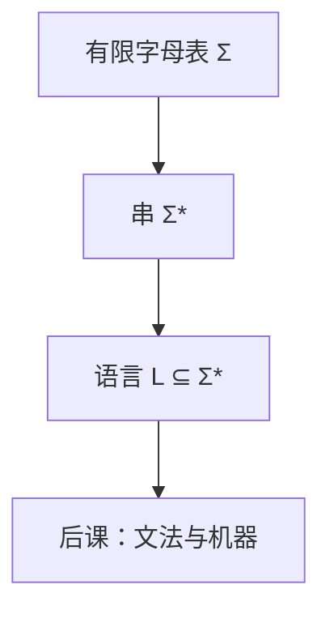

# 字母表、串与语言

计算理论的第一批对象不是门和进程，而是有限符号、有限串，以及串的集合；语言是集合，不是自然语言。

<footer>—— 据 Hopcroft, Motwani and Ullman, Introduction to Automata Theory；Sipser, Introduction to the Theory of Computation 整理</footer>

主干在[系统边界](/cs/to-systems-boundary)封口：从比特到隔离与会话，可执行的系统栈已经闭合。本课是补层「计算理论」第一课，不重开组成、不重讲操作系统。缺口是另一类问题——**哪些串集合能被机器认、判定、计数**——要从字母表写起。后课默认已经读完本课。

## 问题

[比特作为区分](/cs/bit-as-distinction)把世界切成 $\{0,1\}$；那是编码层的最小字母表，不是本课的起点。理论课允许任意有限非空 $\Sigma$（记号、自然数的十进制数字、栈符号），$0/1$ 只是其中一个特例。对比：比特问「两种状态如何编号」；字母表问「符号一旦给定，串与语言怎么写」。不要把本课写成第一课的续篇。

字母表 $\Sigma$ 有限。串是 $\Sigma$ 上的有限序列，含空串 $\varepsilon$。$\Sigma^*$ 是全体串。语言 $L\subseteq\Sigma^*$。运算：连接 $LL'$、并、Kleene 星 $L^*$。后课自动机认的是语言，不是「一个程序在干什么」。

### 语言不是语法，也不是语义

日常把 language 当成自然语言或编程语言。这里 $L$ 只是串集：可以不可判定、可以没有文法、可以没有「意思」。CFG、类型、真值都是后课往这个集合上加的结构。本课只钉集合本身。

Hopcroft–Ullman 与 Sipser 都以 $\Sigma,w,L$ 开篇。Chomsky 把语言当生成对象；本课先当集合，下一课才分层。空语言 $\emptyset$ 与 $\{\varepsilon\}$ 不同：一个没有串，一个只有空串。

## 方法

约定：$\Sigma$ 有限且事先固定；后课换字母表会显式声明。串长 $|w|$，连接可结合，$\varepsilon$ 是单位元。语言的并、交、补相对 $\Sigma^*$。可数性：$\Sigma^*$ 可数（按长、再按字典序），其幂集不可数——后课对角化要用这一句，本课只登记。

主干[词法](/cs/regex-lexer)已经把记号种别当成正则语言用过；那里 $\Sigma$ 是源字符。本课把同一写法收成理论原语，不再谈最长匹配。

## 机制

有了 $L$，才能问：有没有有限描述（正则、文法、图灵机）生成或识别它。描述是对象，语言是外延。两个不同文法可以同语言。后课等价、最小化、不可判定，比的都是外延或「是否存在某类描述」，不是程序文本是否相同。

编码：任何有限对象可写成 $\Sigma=\{0,1\}$ 上的串。补层后半的图灵机、归约，默认问题已经是语言。这与系统栈里「文件是字节」同一层习惯，对象换成判定问题。

连接与星把有限描述闭成无穷语言，但描述本身仍有限：后课谈的「正则式」「文法」「图灵机」都是有限对象去指称可能无穷的 $L$。$\Sigma^*$ 可数保证后课可以把问题枚举成 $\langle 0\rangle,\langle 1\rangle,\ldots$；幂集不可数保证「大多数语言没有有限描述」——对角化课会用，此处只占坑。

## 边界

本课不定义自动机，不引入产生式，不把 $\{0,1\}^*$ 上的可计算函数写出来。不从 Turing 1936 重讲「什么是计算」——那是本课程后半的缺口。也不把 Shannon 熵请来：符号可以没有概率。

后课默认：谈到语言，即 $\Sigma^*$ 的子集；谈到问题，即把实例编成串之后的语言。Chomsky 层级是下一课把描述能力分层。

## 小结

- 补层从字母表、串、语言起；主干系统栈已在边界封口。
- $L\subseteq\Sigma^*$ 是集合；空语言与 $\{\varepsilon\}$ 不同。
- 比特字母表只是对照，不是本课的生成定义。
- 出处：Hopcroft, Motwani and Ullman；Sipser。
