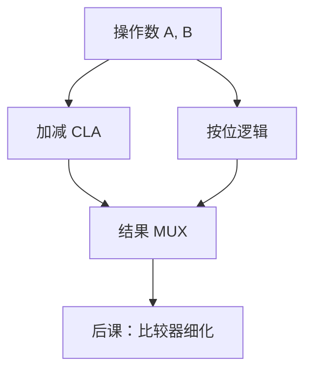

# ALU 数据通路

ALU 不是「会算的云」，而是加法器、逻辑单元与若干 MUX 接在同一组操作数上，由操作码选出哪一路成为结果。

<footer>—— 据 Harris and Harris, Digital Design and Computer Architecture；Patterson and Hennessy, Computer Organization and Design (RISC-V) 整理</footer>

上一课[移位与桶形移位](/cs/barrel-shifter)钉死了加减组合块。本课不重推 $g,p$，也不从 ISA 操作码表另起。缺口是：CPU 还要与、或、异或、移位、置位。需要一条**数据通路**：操作数进入，功能块并行（或复用），MUX 选出结果，并给出零、负、溢出等旗标。

## 问题

加法器只有和。RISC-V 整数指令还要 `and`/`or`/`xor`/`slt`。缺口因此不是再造一种进位，而是把若干组合功能并在 A、B 上：逻辑按位、加减走加法器、比较可借减法的符号与溢出。`ALUOp` 控制内部 MUX 与加法器的 $c_0$、B 反相。本课只钉这条通路；哪条指令产生哪组控制，是[控制器真值表](/cs/control-truth-table)。

移位可以是桶形移位器（MUX 树），延迟另计。本课承认移位是 ALU 家族，不把 $n$ 位桶形的每一级画出。

### ALU 不是微程序仓库

本课的 ALU 是组合：输入稳定后 $t_{pd}$ 内出结果。没有内部逐步微操作。多周期里 ALU 被多次使用，仍是同一组合块加寄存器在外——那是后课。把 ALU 当成「一台小 CPU」，会与存储程序混层。

Harris 与 Patterson/Hennessy 都把 ALU 画成带 ALUControl 的框。`slt` 用减法后看负异或溢出，把比较并进算术通路。

## 方法

A、B 入。B 经 MUX 选原值或 $\bar B$。加法器算 $A+B_{\mathrm{sel}}+c_0$。逻辑单元算 $A\land B$ 等。结果 MUX 按 `ALUControl` 选。零旗标是结果各位或非。

## 机制

后课寄存器堆的两个读口接到 A、B；写口接结果（或更后的 MemtoReg）。关键路径包含 ALU 的 $t_{pd}$。`sub` 与 `beq` 都可能用减法：零旗标给相等。本课不接 PC 与立即数——那是单周期数据通路把 ALUSrc 再加一层 MUX。

## 边界

本课不实现除法、不把浮点 FPU 画进同一框。乘法可视为后课独立单元。比较器下一课可以强调无加减的幅度比较；本课已允许用减法实现 `slt`。

后课默认：整数 ALU 是组合，功能由一小组控制位选择；加减共用 CLA。

## 小结

- ALU = 算术块 + 逻辑块 + 结果选择。
- 控制位来自后课译码，本课只留端口。
- 仍是组合，延迟计入 CPU 关键路径。
- 出处：Harris and Harris；Patterson and Hennessy, COD (RISC-V)。
