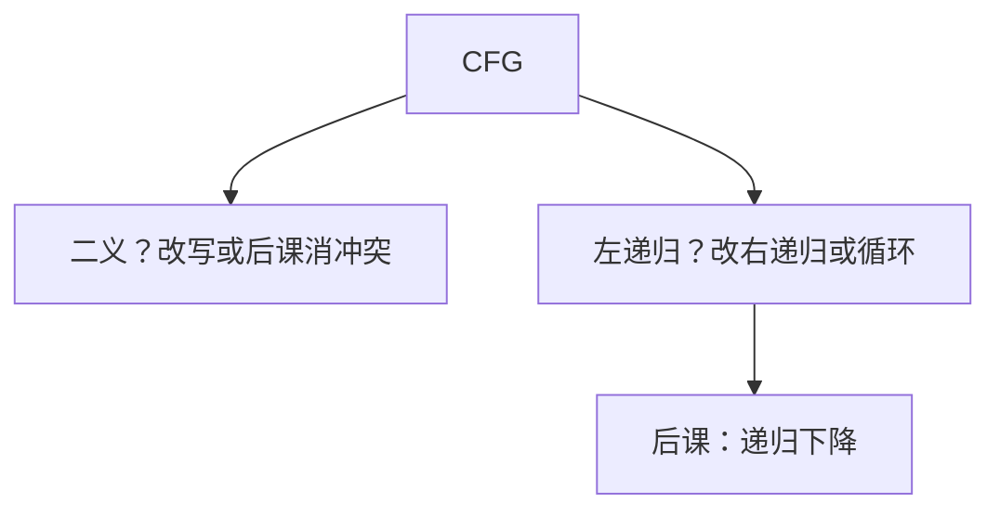

# 二义与左递归

同一终结串两棵推导树即二义；左递归让最左推导尚未读记号就展开自己，递归下降不停机。

<footer>—— 据 Chomsky, 1959；龙书第 4 章整理</footer>

上一课[上下文无关文法](/cs/cfg-grammar)定义了产生式与推导树，并声明二义必须消、左递归留给分析器课。本课不重写 $G=(V,\Sigma,P,S)$。缺口是两件会让下一课递归下降直接翻车的性质：悬空 else 这类二义，以及 $E\to E+T$ 这类左递归——后者要在文法上改写成右递归或循环，分析函数才停。FIRST 表下一课才系统算。

## 问题

二义：存在 $w$ 有两棵不同的最左推导树。运算符优先级没写进文法时 `1+2*3` 两棵；`if`–`else` 与内层 `if` 配对两可。语义要唯一 AST，必须改产生式（分层 $E$、$T$、$F$）或在后课 LR 里用优先级声明消冲突。改写后语言应不变，树的形状按语言约定（左结合即左深树）。

左递归：$A\stackrel{+}{\Rightarrow}A\alpha$。递归下降 `parseA` 先调 `parseA`，前瞻未消耗。消除：把 $A\to A\alpha\mid\beta$ 改成 $A\to\beta A'$，$A'\to\alpha A'\mid\varepsilon$（右递归），或写成 `parseA` 里先吃 $\beta$ 再循环吃 $\alpha$。间接左递归要先代换。缺口是识别与改写，不是写完整下降器。

### 左递归不是二义

左递归文法可以无二义（标准算术分层仍左递归）。二义文法也可以无左递归。两件事都碍分析，原因不同：一棵树 vs 停机。

龙书 4.3 节消除左递归、提取左公因子。Chomsky 层级不管二义；二义是分析器工程。Yacc 的优先级是后课 LR 的出口，本课以改写文法为主。

## 方法

对二义：给两棵树，改分层或强制 else 绑定。对左递归：找出环 $A\Rightarrow A\alpha$，套标准改写。提取公因子 $A\to\alpha\beta\mid\alpha\gamma$ 变成 $A\to\alpha B$，供后课 LL(1) 一眼看穿。

语言是否仍同一：改写是语法变换，应保持 $L(G)$。优先级分层改变的是树，不是串集合——若原文法二义，串集合本就对多棵树。

## 机制

改写后非终结符变多，推导变长，AST 仍应压缩分层节点——[抽象语法树](/cs/ast) 再丢。本课不建树。也不要把「有二义所以不是 CFG」：CFG 可以二义；无二义 CFG 才适合当程序语言定义。

左递归对 LR 无妨，对 LL 有妨。下一课是下降，故本课必须先改。

## 边界

本课不写 FIRST/FOLLOW，不移进归约。不处理通用二义检测（那是不可判定的问题族边缘，点名：任意 CFG 是否二义不可判定，程序语言用手改）。后课默认：交给递归下降的文法无左递归、尽量无二义。下降器把最左推导写成函数。

## 小结

- 二义 = 一串多树；用分层或绑定规则消。
- 左递归使下降不停机；改写成右递归或循环。
- 两性质独立；下一课才写 `parseA`。
- 出处：Aho et al., 龙书第 4 章；Chomsky, 1959。
