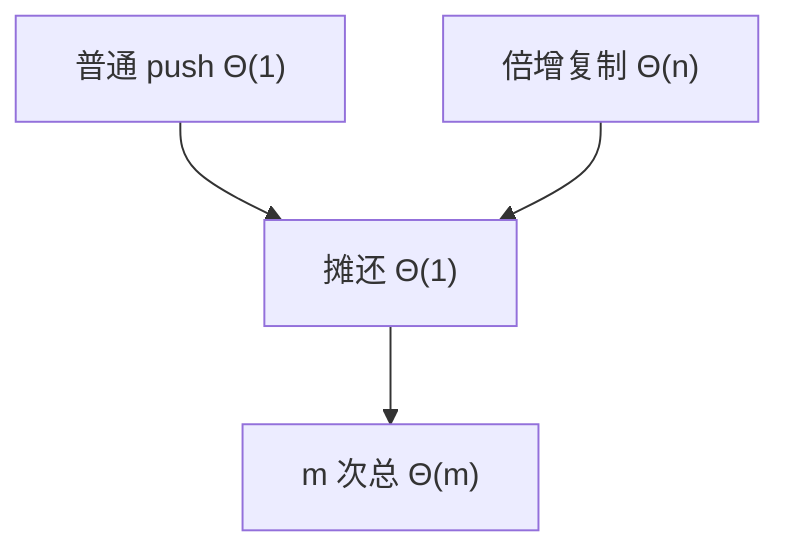

# 摊还分析

最坏单次可以很贵，只要贵的次数被足够多次便宜操作摊平；表的倍增复制就是这一笔账。

<footer>—— 据 Tarjan, Amortized Computational Complexity, SIAM J. Algebraic Discrete Methods 1985；Cormen, Leiserson, Rivest and Stein 整理</footer>

[上一课](/cs/ring-buffer)和[数组与随机访问](/cs/array-random-access)都避开了「满了怎么办」。动态数组在容量用尽时分配两倍空间并复制，单次 $\Theta(n)$，看起来破坏了 $\Theta(1)$ 合同。[渐近记号](/cs/asymptotic-notation)给的是单次或最坏。本课不重讲 FIFO。缺口是：对一串操作求和再除次数，让偶发的线性复制不影响平均每操作 $\Theta(1)$。本课只钉摊还，方法用合计与势能，不把核函数摊还写完。

## 问题

若合同写成「每次 push 最坏 $\Theta(1)$」，倍增数组是撒谎。若写成「每次最坏 $\Theta(n)$」，又掩盖了 $n$ 次 push 总共 $\Theta(n)$ 的事实。缺口不是新的表示，而是第三种代价声明：**摊还 $\Theta(1)$**——任意 $m$ 次操作总时间 $\Theta(m)$，因而平均每次 $\Theta(1)$，但单次可以是线性。

最坏仍然存在：实时路径若不能容忍那一次复制，应预分配或用链表。摊还不是消灭峰值。

势能法把「已分配而尚未用的空槽」当成储蓄。复制时把储蓄花掉，不让总账变负。

## 方法

合计：从空表倍增到 $n$，复制长度 $1+2+\cdots+n/2 < n$，全部 push 的插入本身也是 $n$，总和 $\Theta(n)$。势能 $\Phi$：取 $\Phi=$ 当前长度与容量之差的常数倍，使每次便宜操作 $\hat{c}=c+\Delta\Phi=O(1)$，复制时 $\Delta\Phi$ 为负、抵消 $\Theta(n)$。

收缩可对称地减半，须避免在阈值附近振荡；细节是实现，本课要求总账仍线性。

## 机制

有了摊还，动态数组可以进入栈与队列的合同：无界、摊还 $\Theta(1)$ 端操作。后课散列的再散列、并查集的路径压缩，同一套语言。二叉树平衡的单次旋转仍是最坏 $\Theta(1)$，不需要摊还；伸展树才靠摊还。

摊还不假设概率。期望分析（随机散列、随机快排）是另一张账单，后课会分开写。势能必须对空结构取零（或非负），否则合计会偷一项常数债。

## 边界

本课不证明所有 ADT 都有摊还界。也不把摊还与并行加速比混谈。缓存缺失的摊还（扫描的强制缺失）可以类比，但存储器层次仍用命中率说话。

后课默认：动态表 push 摊还 $\Theta(1)$。查找按键而不是按下标，需要有序树：下一课 BST。

## 小结

- 摊还描述一串操作的平均，允许峰值。
- 倍增数组：$m$ 次 push 总 $\Theta(m)$。
- 有序字典的树表示是下一课，最坏先按高度算。
- 摊还不是期望：没有随机假设，实时路径仍可能碰到那一次 $\Theta(n)$。
- 出处：Tarjan, 1985；Cormen et al. 第 17 章。
