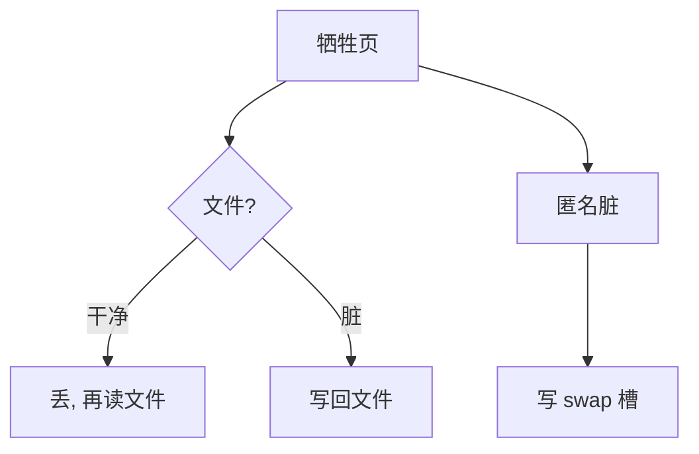

# 匿名页对文件页

文件页扔掉还能从文件再读；匿名页没有文件副本，脏了就必须进交换区，否则内容消失。

<footer>—— 据 Silberschatz et al.；Bovet and Cesati 对 Linux 页来源的整理</footer>

[上一课](/cs/thrashing)把所有页算进工作集。[缺页路径](/cs/page-fault-path)已经能从文件填页或填零。[置换](/cs/page-replace)说只读文本可丢弃。缺口是钉死两类**后备**：文件页（inode + 偏移）与匿名页（堆、栈、匿名 mmap、COW 私有副本）。CLOCK 扫描到它们时，写回目标不是同一个设备。

## 问题

若把文本页写进 swap，浪费交换槽且与可执行文件重复。若把改过的堆页只标无效而不写出，进程稍后读到的是空洞或别人的帧。缺口不是再讲 VMA，而是页描述符上的来源：文件映射指向 [VFS](/cs/vfs) 之后才完全展开的 inode；匿名页指向交换槽或「尚无槽的脏匿名」。干净文件页：解映射即可。脏文件页：写回文件。脏匿名页：写 swap。

本课不把 shmem/tmpfs 的全部特例写完，只承认它们像「有文件外形的匿名」。

同一物理页可被文件映射共享。淘汰时要看映射类型与脏位，不能只看 CLOCK 指针。后课 mmap 会把共享/私有写清楚；本课先分后备设备。

## 方法

缺页填页时记录 mapping。置换选中：查来源。文件且干净 → 丢；文件且脏 → 加入对文件系统的回写（缓冲课）。匿名且干净（如未写过的零页）→ 丢；匿名且脏 → 分配交换槽、写交换设备。之后 PTE 改为「不在内存」，编码里带槽号或再缺页时查换出表。

## 机制

分类让抖动对策更细：优先丢干净文件页，等于用磁盘文件当免费后备；匿名压力才真正吃 swap。工作集里的堆页因此「更贵」。不要在此展开 ext4 布局；文件只是可再次 `readpage` 的对象。[分页](/cs/paging-vm) 仍然只看见有效位；来源在内核页框数据结构里。

## 边界

本课不引入交换分区的条带与优先级全文。不把设备页（framebuffer）混进匿名。文件空洞与稀疏文件在缺页时可能填零，仍算文件来源。下一课才问 swap 设备长什么样、槽如何分配。

后课默认：匿名脏页必须有交换去处。槽在哪、如何成设备，下一课 swap。

## 小结

- 文件页以文件为后备；匿名脏页以 swap 为后备。
- 淘汰代价不同，工作集会计应分开看。
- 交换槽与设备是下一课。
- 出处：Silberschatz et al., *OSC*；Bovet and Cesati, *ULK*；Tanenbaum *MOS*。
