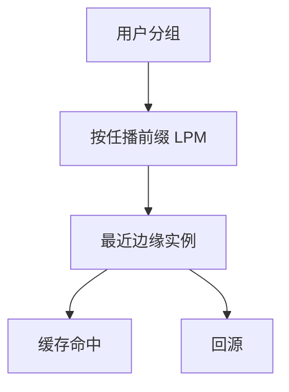

# 任播与边缘

同一前缀从多处宣告，分组被路由到「最近」的实例；CDN 用它把用户送到边上的缓存节点。

<footer>—— 据 Kurose and Ross；对照 RFC 4786 对任播操作的讨论；Nygren 等对 CDN</footer>

[上一课](/cs/cdn-intuition)给出边缓存与请求导向。本课不重讲为何复制对象。缺口是导向手段之一：**任播**——多点宣告同一地址，靠 [BGP](/cs/bgp-policy) 与 [LPM](/cs/lpm) 把用户送进最近的 PoP。DNS 导向是另一手段，上一课已点名。本课不把套接字 API 提前。

## 问题

CDN 直觉留下「DNS 或任播」。DNS 按解析器位置返回不同 A/AAAA，粒度是解析器不是客户。任播：边缘节点共享前缀，路由自然选近。TCP 连接必须粘在同一实例上：路径变化会把后续段送到另一台没有状态的机器。缺口是**用路由当负载均衡**及其与有状态传输的张力。

无状态的 UDP DNS 很适合任播。HTTPS 依赖稳定路径或把状态同步到任播集合——工程上常「任播到 PoP，PoP 内再用本地负载均衡」。

## 方法

运营商在多地宣告同一覆盖前缀。用户的 SYN 到达某边缘，该边缘完成 [TCP 握手](/cs/tcp-handshake) 与 [TLS 入口](/cs/http-tls-entry)。缓存命中则本地答；未命中回源。故障时撤宣告，前缀收敛到活着的点。与单播对照：地址不再标识唯一主机，标识的是服务。

## 机制

任播把控制平面政策变成「距离」上的选路，边缘把 [HTTP 缓存头](/cs/http-semantics) 的允许落到地理上。它不提供新的端到端可靠性；路径漂移是任播的经典故障。安全：证书仍绑名字，不绑任播地址本身。

## 边界

本课不把全球 Anycast 的测量论文当必读，不引入把 TCP 状态在 PoP 间实时迁移的全部方案。应用如何拿到描述符并读写，下一课套接字 API。

后课默认：同一地址可以表示一群边缘。进程眼里的端点是套接字。

## 小结

- 任播靠路由把用户送到近处实例。
- 有状态传输要粘会话或把状态留在 PoP 内。
- 套接字 API 下一课。
- 出处：Kurose and Ross；RFC 4786；对照 CDN 文献。
