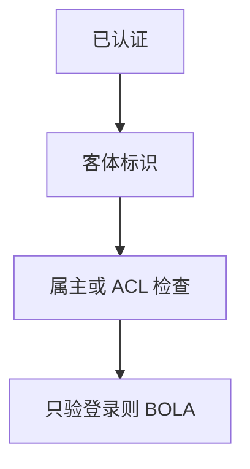

# API 安全与 BOLA

对象级授权失败：认证过了，但改一个标识就碰到别人的资源。API 把客体直接暴露成 URL 与 JSON，授权必须每对象检查，而不是只检查已登录。

<footer>—— 据 OWASP API Security；CWE-639 IDOR；对照[最小特权](/cs/acl-least-priv)</footer>

## 定位

上一课[WAF](/cs/waf)几乎不管这个标识是不是你的。缺口是 **BOLA 与 IDOR**。Web 课序在此收口，下一课序网络防御。不给盗数据步骤。

后课默认已经读完本课钉下的合同，只补差，不从该领域第一性原理重开。

## 问题

按对象标识取资源时只验会话。缺口：每请求检查属主或能力令牌。批量接口更容易漏。

### 查询语言接口

标识与节点同样要授权，内省不是许可。

OWASP API1。禁止 IDOR 利用教程。IDS 下一课换到网络流量视角。

## 方法

测试：换标识、换租户。设计：不可预测标识只提高代价，不是授权。下一课 IDS/IPS。

图中节点是本课的机制骨架；课程不把图展开成可运行的攻击步骤。

## 机制

Web 单元收口：从 XSS 到客体授权。网络防御单元从流量检测起，假定应用仍会漏。

前提写进合同之后，游戏外的误用只当失败模式点名，不在本课写成操作程序。

## 边界

零盗取教程。下一课序 IDS/IPS。

## 小结

- WAF 看不见对象属主。
- BOLA：认证不等于对该客体的授权。
- 每对象检查；随机标识不是 ACL。
- 下一课序：IDS/IPS。
- 出处：OWASP API Security；CWE-639。
