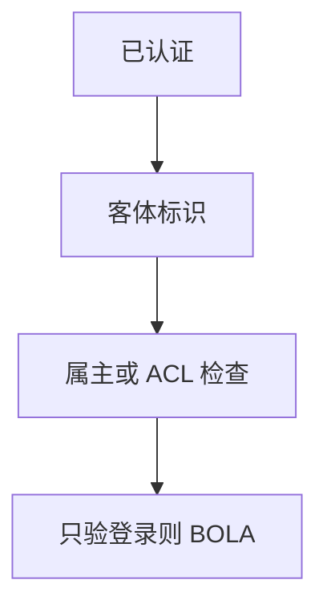
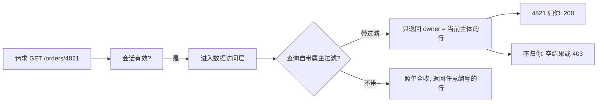

# API 安全与 BOLA

对象级授权失败：认证过了，但改一个标识就碰到别人的资源。API 把客体直接暴露成 URL 与 JSON，授权必须每对象检查，而不是只检查已登录。

<footer>—— 据 OWASP API Security；CWE-639 IDOR；对照[最小特权](/cs/acl-least-priv)</footer>

上一课[WAF](/cs/waf)收尾时说它几乎不管「这个对象标识是不是你的」；缺口正是 **BOLA 与 IDOR**。Web 课序在此收口，下一课序转向网络防御。不给盗数据步骤。

后课默认已经读完本课钉下的合同，只补差，不从该领域第一性原理重开。

## 问题

REST 把对象直接暴露成 URL 与 JSON：/orders/4821 里那个数字就是客体标识。漏洞形态是服务器验了会话（你是合法用户）却没验属主（这单是不是你的），改一个数字就碰到别人的资源。缺口是每请求的属主或能力检查——在数据访问层按属主过滤，而不是在路由层验完登录就放行；批量接口与导出功能更容易漏。

数字实例：订单号若是自增整数，攻击者把 URL 里的 4821 换成 4822、4823 逐个试，一晚就能遍历全站订单。UUID 把猜测代价升到天文数字，但标识一旦从邮件或分享链接里泄露，这层防护立刻归零——它只是减速带，不是门锁。

### 查询语言接口

GraphQL 这类查询语言接口同理：每个节点与字段同样要授权，内省（introspection）只告诉你 schema 长什么样，不是读数据的许可。

术语翻译：内省就像餐厅把完整菜单印给你看——你知道后厨能做什么菜，但能不能上桌仍要一桌一桌核资格。漏扫工具常靠内省枚举字段，看到的只是菜单；每字段照常鉴权，菜单公开也不碍事。

OWASP API1。禁止 IDOR 利用教程。IDS 下一课换到网络流量视角。

## 方法

方法分两侧。测试侧：对每个取对象的端点换标识、换租户重放，确认 403 而非 200。设计侧：把属主检查压进数据访问层——查询自带「属主 = 当前主体」过滤，或改用与用户绑定的能力令牌。不可预测的标识（UUID）只提高枚举代价，不是授权：标识一旦经邮件、协作功能泄漏，这条防线即无。下一课 IDS/IPS。

```mermaid
flowchart TD
  AUTH["已认证"] --> OBJ["客体标识"]
  OBJ --> AUTHZ["属主或 ACL 检查"]
  AUTHZ --> FAIL["只验登录则 BOLA"]
```

## 机制

机制上是整个 Web 单元的收口：从 XSS 的注入执行、CSRF 的请求伪造到 BOLA 的客体越权，共同教训是「每层信任判定要有独立证据」——认证的证据不能挪用为授权的证据。下一课序从流量检测起步，前提是假定应用仍会漏：BOLA 不留注入特征，常规 WAF 与漏扫看不见，这正是纵深需要检测层的原因。

常见误区：初学者容易以为「登录了接口就安全」。实际上认证回答「你是谁」，授权回答「这个对象归不归你」，两问必须各自取证——把前者的答案挪去顶替后者，就是 BOLA 的全部成因。

```mermaid
flowchart LR
  REQ["请求 GET /orders/4821"] --> SES["会话有效?"]
  SES -->|是| Q["进入数据访问层"]
  Q --> F{"查询自带属主过滤?"}
  F -->|带过滤| SAFE["只返回 owner = 当前主体的行"]
  F -->|不带| LEAK["照单全收, 返回任意编号的行"]
  SAFE --> R1["4821 归你: 200"]
  SAFE --> R2["不归你: 空结果或 403"]
```

## 边界

零盗取教程；边界要点名：对象级授权错误是逻辑缺陷——响应正常、属主错误，自动化工具覆盖差，测试要靠人按数据模型逐个走。下一课序 IDS/IPS。

## 小结

- WAF 看不见对象属主。
- BOLA：认证不等于对该客体的授权。
- 每对象检查；随机标识不是 ACL。
- 下一课序：IDS/IPS。
- 出处：OWASP API Security；CWE-639。
