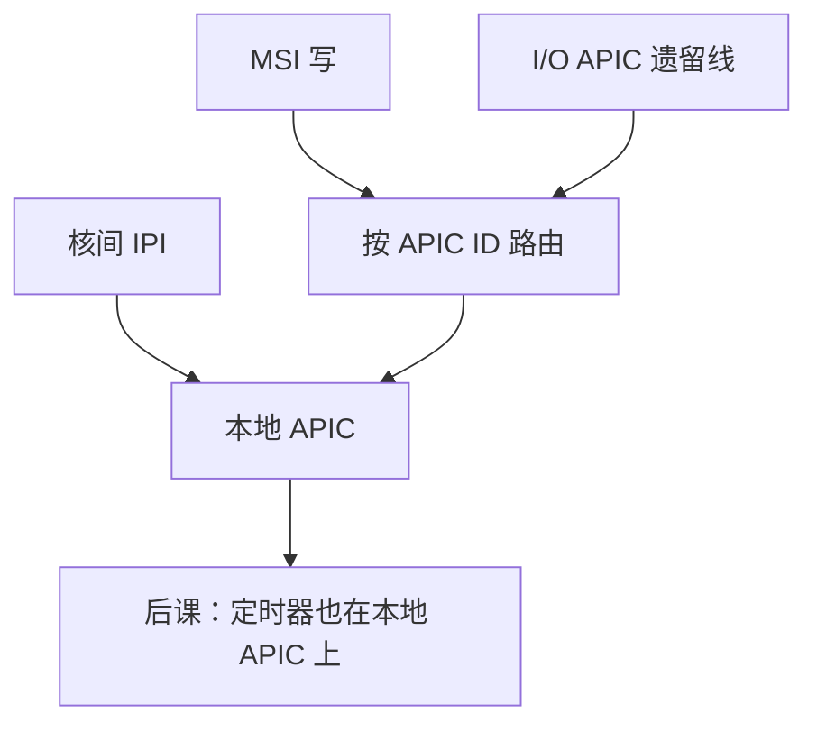

# APIC 与中断路由

  
每颗核有本地 APIC，I/O APIC 或消息窗口把向量送到选定的 APIC ID；路由决定哪颗 CPU 跑处理函数，而不是设备再拉一根线到那颗核。

  <footer>—— 据 Intel 64 and IA-32 Architectures Software Developer’s Manual；Patterson and Hennessy, Computer Organization and Design 整理</footer>

[上一课](/cs/msi-msix)把设备中断变成写消息。RISC-V 教学用 [PLIC](/cs/plic-irq)。x86 世界缺口是 **APIC 体系**：Local APIC、I/O APIC、x2APIC MSR，以及如何把 MSI 地址里的目标变成某核的向量。

## 问题

8259 PIC 只够单核。APIC：每个处理器一个本地单元（定时器、IPI、接收中断），I/O APIC 连遗留线。MSI 地址编码目标 APIC ID 与投递模式（固定、最低优先级）。缺口不是 MSI 表格式，而是**路由策略**：绑定到一核 vs 分散，与 OS 的 irq affinity 同一对象。

IPI：核间中断，用于 TLB shootdown、停机，不是 PCIe 设备发出的。本课点名，机制同本地 APIC 接收。

### APIC 不是「另一套 PCIe 根复合体」

它是中断控制器，配置曾走 MMIO（APIC 基址），x2APIC 改 MSR。不参与 BAR 枚举（除了作为 MSI 写的目标）。把 APIC 当端点设备扫 Vendor ID，枚举代码会迷路。

Intel SDM 卷 3 是 APIC 主文献。AMD 有兼容实现。ARM GIC 是平行设计，后课 AArch64 点到即可，本课以 APIC 钉 x86 主机侧。

## 方法

OS 初始化本地 APIC、写 TPR、校准 APIC 定时器（下一课定时器家族）。对 MSI-X：填写目标 APIC ID。最低优先级投递依赖仲裁，现代 OS 多用固定亲和。虚拟化：APIC 虚拟化减少 VM-exit，本课不展开。

RISC-V 平台若用 IMSIC，每 hart 入队 MSI，思想同「每核接收器」，寄存器不同。

## 机制

定时器、热插拔 CPU、电源状态都会改「谁能收中断」。DMA 与中断的配对：数据 DMA 完成对主机内存可见后才发 MSI，否则处理函数读到旧描述符——围栏与 PCIe 序，下一课 DMA 展开。本课先把向量送到核。

## 边界

本课不列全部投递模式比特，不写 PIC 级联历史作业。不把 GIC 寄存器表抄满。不进入中断延迟的实时操作系统全书。

后课默认：x86 上 MSI 目标是 APIC 路由到 Local APIC；IPI 走同一接收器。

## 小结

- Local APIC 每核接收；I/O APIC 收遗留线。
- MSI 地址携带 APIC ID；OS 决定亲和。
- IPI 是核间，不是 PCIe 设备。
- 出处：Intel SDM；Patterson and Hennessy, COD；PLIC 对照。
