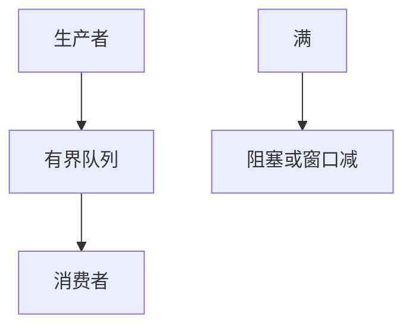

# 应用层背压

慢消费者必须让生产者少发：窗口、阻塞写、队列上限或显式信号。否则内存当无限缓冲，延迟与 OOM 替代了丢包。

<footer>—— 据 TCP 窗口对照；Reactive Streams 背压；RFC 9113 流控整理</footer>

[TCP 窗口](/cs/tcp-window) 与 [PFC](/cs/pause-pfc) 已给下层反压。[C10K](/cs/c10k-concurrency) 的事件循环若盲目 `read` 会堆内存。[上一课](/cs/retry-idempotency) 的重试会加重生产者。缺口是**应用背压**：把反压接到业务。本课结束计算机网络进阶；下一课程是数据库进阶。

## 问题

运输窗口满则 `write` 阻塞或 EAGAIN，这是 TCP 背压。应用若在用户态无限队列「先收着」，等于把膨胀搬进进程，心跳仍绿、业务已死。H2/QUIC 每流窗口是应用可见的运输背压。Reactive 流 `request(n)` 显式拉。令牌桶在入口限速是策略背压。SSE 若生产快于浏览器，要停生成器。

不要把杀进程当背压。

HTTP/2 流控。Reactive Streams 规范。本课钉原则。

### 有界缓冲才是反压

无限用户态队列取消 rwnd 的意义。可与 PFC、H2 窗口叠三层。重试在满载时要停。「先打进队列」只是改名膨胀。

## 方法

对照：无限队列 / 有界队列阻塞 / 窗口 / 丢弃策略。画：快生产 → 信号 → 减速。与 DCTCP 浅队列同构，一层应用。

方法止于选定对象与对照；机制才说它如何嵌入已有分层与主干课。

## 机制

gRPC 流控、TCP rwnd、PFC 可叠三层；只开一层会在其它层爆。重试在背压时要停。负载均衡把溢出转到它机是横向背压。测量：队列深度与 p99，不是只看 iperf。

与端到端：最终仍要消费者处理完，背压只是保护途中内存。

## 边界

本课不引入某语言异步库的全部 API。数据库进阶从 SQL 聚合另起，不在此插入。后课默认：应用必须有界缓冲并向下反压。

「先打进 Kafka 再算」只是把膨胀换了个名字，仍要有界。

上一课留下的缺口在本课收口；「应用层背压」进入后课词汇表后只引用。文献用来钉对象与边界，不把本课写成该主题的独立综述。下一课[聚合与 GROUP BY](/cs/sql-aggregation)。

## 小结

- 无限用户态队列取消了运输窗口的意义。
- 用窗口、有界阻塞或显式 request。
- 与 PFC/rwnd 分层叠，不要只信一层。
- 后课只引用本课钉死的对象，不从该领域总问题重开。
- 出处：RFC 9113 流控；TCP 窗口；Reactive Streams。
